```python
import numpy as np

import pandas as pd

import matplotlib.pyplot as plt
import seaborn as sns

import scipy.stats as sc
from scipy.cluster.hierarchy import linkage, cut_tree, leaves_list

from sklearn.decomposition import PCA
from sklearn.ensemble import RandomForestRegressor, RandomForestClassifier, GradientBoostingClassifier
from sklearn.preprocessing import PolynomialFeatures
from sklearn.linear_model import LinearRegression, ElasticNet
from sklearn.model_selection import train_test_split
from sklearn.cluster import KMeans

from qlr import QuantileLinearRegression

import os
```


```python
def elapsedtime_to_sec(el):
    tab = el.split(":")
    return float(tab[0])*60+float(tab[1])
#because x264 output is "m:s", where m is the number of minutes and s the number of seconds 

res_dir = "../../data/res_ugc/"

v_names = sorted(os.listdir(res_dir)) # so we keep the same ids between two launches

listVideo = []

for v in v_names:
    data = pd.read_table(res_dir+v, delimiter = ',')
    data['etime'] = [*map(elapsedtime_to_sec, data['elapsedtime'])]
    assert data.shape == (201,36) or data.shape == (201,34), v
    listVideo.append(data)
```


```python
#our variable of interest
predDimension = "fps"
```

# RQ1 - Input sensitivity

## RQ1.1 - Do the same options have the same effect on all inputs?


```python
nbVideos = len(listVideo)
corrSpearman= [[0 for x in range(nbVideos)] for y in range(nbVideos)]

for i in range(nbVideos):
    for j in range(nbVideos):
        if (i == j):
            corrSpearman[i][j] = 1
        else:
            corrSpearman[i][j] = sc.spearmanr(listVideo[i][predDimension],
                                            listVideo[j][predDimension]).correlation
```


```python
result_dir = "../results/"

def plot_correlationmatrix_dendogram(corr, img_name, ticks, method= 'ward', div=False):

    df = pd.DataFrame(corr)
    
    # group the videos
    links = linkage(df, method=method,)
    order = leaves_list(links)
    
    # Generate a mask for the upper triangle
    mask = np.zeros_like(corr, dtype=np.bool)
    
    for i in range(nbVideos):
        for j in range(nbVideos):
            if i>j:
                mask[order[i]][order[j]] = True
    
    sns.clustermap(df, cmap="vlag", mask=mask, method=method,
                   linewidths=0, figsize=(13, 13), cbar_kws={"ticks":ticks}, vmin =-0.5)
    plt.savefig(result_dir+img_name)
    plt.show()
    
    return cut_tree(links, n_clusters = 3)

group_no_ordered = plot_correlationmatrix_dendogram(corrSpearman, 
                                 "corrmatrix-ugc-dendo-Spearman-" + predDimension + ".png",
                                 [k/5 for k in np.arange(-10,10,1)], method='ward')
```


    

    


```python
map_group = [1, 2, 0]

def f(gr):
    return map_group[int(gr)]

groups = np.array([*map(f, group_no_ordered)],int)

sum(groups==0)
sum(groups==1)
sum(groups==2)
```


    39


```python
corrDescription = [corrSpearman[i][j] for i in range(nbVideos) for j in range(nbVideos) if i >j]
pd.Series(corrDescription).describe()
```


    count    450775.000000
    mean          0.925205
    std           0.094985
    min           0.005051
    25%           0.921212
    50%           0.955909
    75%           0.972997
    max           0.996437
    dtype: float64


```python
def plot_simple_correlationmatrix_dendogram(corr, img_name, ticks, id_names, method='ward'):

    df = pd.DataFrame(corr)
    
    # Generate a mask for the upper triangle
    mask = np.zeros_like(corr, dtype=np.bool)
    
    for i in range(shortnbVideos):
        for j in range(shortnbVideos):
            if i>j:
                mask[i][j] = True
    fig = plt.figure(figsize=(10, 8.5))
    ax = fig.add_subplot(1,1,1)
    sns.heatmap(df, cmap="vlag", mask=mask,
               linewidths=.75, cbar_kws={"ticks":ticks})
    plt.yticks(np.arange(0,len(id_names),1)+0.5, id_names)
    plt.xticks(np.arange(0,len(id_names),1)+0.5, id_names)
    plt.savefig(result_dir+img_name)
    plt.show()
```


```python
id_short = [10, 14, 23, 26, 31, 41, 55, 66, 67, 125]
short_v_names = [v_names[k] for k in id_short]

shortlistVideo = []
for v in short_v_names:
    data = pd.read_table(res_dir+v, delimiter = ',')
    data['etime'] = [*map(elapsedtime_to_sec, data['elapsedtime'])]
    shortlistVideo.append(data)
    
shortnbVideos = len(shortlistVideo)

shortcorrSpearman= [[0 for x in range(shortnbVideos)] for y in range(shortnbVideos)]


for i in range(shortnbVideos):
    for j in range(shortnbVideos):
        if (i == j):
            shortcorrSpearman[i][j] = 1
        else:
            shortcorrSpearman[i][j] = sc.spearmanr(listVideo[id_short[i]][predDimension],listVideo[id_short[j]][predDimension]).correlation

plot_simple_correlationmatrix_dendogram(shortcorrSpearman, 
                     "corrmatrix-ugc-dendo-Spearman-short-" + predDimension + ".png", 
                     [k/5 for k in np.arange(-10,10,1)],
                                      id_short)
```


    
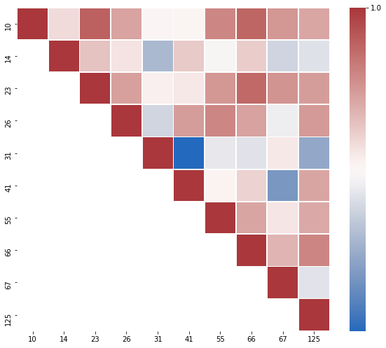
    


# RQ1-2

### Shortlist


```python
id_short
```


    [10, 14, 23, 26, 31, 41, 55, 66, 67, 125]


```python
shortlistVideo[0] # video 10
```


<div>
<style scoped>
    .dataframe tbody tr th:only-of-type {
        vertical-align: middle;
    }

    .dataframe tbody tr th {
        vertical-align: top;
    }

    .dataframe thead th {
        text-align: right;
    }
</style>
<table border="1" class="dataframe">
  <thead>
    <tr style="text-align: right;">
      <th></th>
      <th>configurationID</th>
      <th>cabac</th>
      <th>ref</th>
      <th>deblock</th>
      <th>analyse</th>
      <th>me</th>
      <th>subme</th>
      <th>mixed_ref</th>
      <th>me_range</th>
      <th>trellis</th>
      <th>...</th>
      <th>usertime</th>
      <th>systemtime</th>
      <th>elapsedtime</th>
      <th>cpu</th>
      <th>frames</th>
      <th>fps</th>
      <th>kbs</th>
      <th>ssim</th>
      <th>ssimdb</th>
      <th>etime</th>
    </tr>
  </thead>
  <tbody>
    <tr>
      <th>0</th>
      <td>1</td>
      <td>0</td>
      <td>1</td>
      <td>0:0:0</td>
      <td>0:0</td>
      <td>dia</td>
      <td>0</td>
      <td>0</td>
      <td>16</td>
      <td>0</td>
      <td>...</td>
      <td>8.69</td>
      <td>0.92</td>
      <td>0:01.75</td>
      <td>549</td>
      <td>480</td>
      <td>379.18</td>
      <td>7675.34</td>
      <td>NaN</td>
      <td>NaN</td>
      <td>1.75</td>
    </tr>
    <tr>
      <th>1</th>
      <td>101</td>
      <td>1</td>
      <td>2</td>
      <td>1:0:0</td>
      <td>0x3:0x113</td>
      <td>hex</td>
      <td>6</td>
      <td>1</td>
      <td>16</td>
      <td>1</td>
      <td>...</td>
      <td>29.88</td>
      <td>1.56</td>
      <td>0:04.08</td>
      <td>770</td>
      <td>480</td>
      <td>137.35</td>
      <td>2722.25</td>
      <td>NaN</td>
      <td>NaN</td>
      <td>4.08</td>
    </tr>
    <tr>
      <th>2</th>
      <td>102</td>
      <td>1</td>
      <td>2</td>
      <td>1:0:0</td>
      <td>0x3:0x113</td>
      <td>hex</td>
      <td>6</td>
      <td>1</td>
      <td>16</td>
      <td>1</td>
      <td>...</td>
      <td>26.00</td>
      <td>1.58</td>
      <td>0:03.04</td>
      <td>905</td>
      <td>480</td>
      <td>194.98</td>
      <td>3179.35</td>
      <td>NaN</td>
      <td>NaN</td>
      <td>3.04</td>
    </tr>
    <tr>
      <th>3</th>
      <td>103</td>
      <td>1</td>
      <td>2</td>
      <td>0:0:0</td>
      <td>0x3:0x3</td>
      <td>umh</td>
      <td>6</td>
      <td>1</td>
      <td>16</td>
      <td>1</td>
      <td>...</td>
      <td>32.80</td>
      <td>1.37</td>
      <td>0:02.89</td>
      <td>1181</td>
      <td>480</td>
      <td>206.63</td>
      <td>3142.93</td>
      <td>NaN</td>
      <td>NaN</td>
      <td>2.89</td>
    </tr>
    <tr>
      <th>4</th>
      <td>104</td>
      <td>1</td>
      <td>16</td>
      <td>1:0:0</td>
      <td>0x3:0x113</td>
      <td>hex</td>
      <td>6</td>
      <td>1</td>
      <td>24</td>
      <td>1</td>
      <td>...</td>
      <td>39.70</td>
      <td>1.41</td>
      <td>0:03.29</td>
      <td>1249</td>
      <td>480</td>
      <td>176.69</td>
      <td>2579.38</td>
      <td>NaN</td>
      <td>NaN</td>
      <td>3.29</td>
    </tr>
    <tr>
      <th>...</th>
      <td>...</td>
      <td>...</td>
      <td>...</td>
      <td>...</td>
      <td>...</td>
      <td>...</td>
      <td>...</td>
      <td>...</td>
      <td>...</td>
      <td>...</td>
      <td>...</td>
      <td>...</td>
      <td>...</td>
      <td>...</td>
      <td>...</td>
      <td>...</td>
      <td>...</td>
      <td>...</td>
      <td>...</td>
      <td>...</td>
      <td>...</td>
    </tr>
    <tr>
      <th>196</th>
      <td>97</td>
      <td>1</td>
      <td>2</td>
      <td>1:0:0</td>
      <td>0x3:0x113</td>
      <td>hex</td>
      <td>4</td>
      <td>1</td>
      <td>16</td>
      <td>0</td>
      <td>...</td>
      <td>24.80</td>
      <td>1.67</td>
      <td>0:03.55</td>
      <td>745</td>
      <td>480</td>
      <td>160.70</td>
      <td>2747.42</td>
      <td>NaN</td>
      <td>NaN</td>
      <td>3.55</td>
    </tr>
    <tr>
      <th>197</th>
      <td>98</td>
      <td>1</td>
      <td>2</td>
      <td>0:0:0</td>
      <td>0x3:0x113</td>
      <td>hex</td>
      <td>4</td>
      <td>0</td>
      <td>24</td>
      <td>0</td>
      <td>...</td>
      <td>21.85</td>
      <td>1.59</td>
      <td>0:03.06</td>
      <td>766</td>
      <td>480</td>
      <td>192.69</td>
      <td>2805.80</td>
      <td>NaN</td>
      <td>NaN</td>
      <td>3.06</td>
    </tr>
    <tr>
      <th>198</th>
      <td>99</td>
      <td>1</td>
      <td>5</td>
      <td>1:0:0</td>
      <td>0x3:0x113</td>
      <td>hex</td>
      <td>6</td>
      <td>1</td>
      <td>16</td>
      <td>1</td>
      <td>...</td>
      <td>32.95</td>
      <td>1.42</td>
      <td>0:03.45</td>
      <td>996</td>
      <td>480</td>
      <td>166.61</td>
      <td>2582.37</td>
      <td>NaN</td>
      <td>NaN</td>
      <td>3.45</td>
    </tr>
    <tr>
      <th>199</th>
      <td>100</td>
      <td>0</td>
      <td>3</td>
      <td>0:0:0</td>
      <td>0x113:0x113</td>
      <td>hex</td>
      <td>6</td>
      <td>1</td>
      <td>16</td>
      <td>1</td>
      <td>...</td>
      <td>26.68</td>
      <td>1.56</td>
      <td>0:02.76</td>
      <td>1022</td>
      <td>480</td>
      <td>218.91</td>
      <td>3379.49</td>
      <td>NaN</td>
      <td>NaN</td>
      <td>2.76</td>
    </tr>
    <tr>
      <th>200</th>
      <td>10</td>
      <td>1</td>
      <td>16</td>
      <td>1:0:0</td>
      <td>0x3:0x133</td>
      <td>tesa</td>
      <td>11</td>
      <td>1</td>
      <td>24</td>
      <td>2</td>
      <td>...</td>
      <td>479.12</td>
      <td>6.38</td>
      <td>0:31.19</td>
      <td>1556</td>
      <td>480</td>
      <td>15.69</td>
      <td>2230.33</td>
      <td>NaN</td>
      <td>NaN</td>
      <td>31.19</td>
    </tr>
  </tbody>
</table>
<p>201 rows × 36 columns</p>
</div>


```python
listFeatures = ["cabac", "ref", "deblock", "analyse", "me", "subme", "mixed_ref", "me_range", "trellis", "8x8dct", "fast_pskip", "chroma_qp_offset", "bframes", "b_pyramid", "b_adapt", "direct", "weightb", "open_gop", "weightp", "scenecut", "rc_lookahead", "mbtree", "qpmax", "aq-mode"]

to_keep = [k for k in listFeatures]
to_keep.append(predDimension)

categorial = ['analyse', 'me', 'direct']

def compute_Importances(listVid, id_short=None):
    
    if not id_short:
        id_short = np.arange(0,len(listVid),1)
        
    listImportances = []

    for id_video in range(len(listVid)):

        df = listVid[id_video][to_keep].replace(to_replace ="None",value='0')

        df['deblock'] =[int(val[0]) for val in df['deblock']]

        for col in df.columns:
            if col not in categorial:
                arr_col = np.array(df[col],int)
                arr_col = (arr_col-np.mean(arr_col))/(np.std(arr_col)+1e-5)
                df[col] = arr_col
            else:
                df[col] = [np.where(k==df[col].unique())[0][0] for k in df[col]]
                arr_col = np.array(df[col],int)
                arr_col = (arr_col-np.mean(arr_col))/(np.std(arr_col)+1e-5)
                df[col] = arr_col

        clf = RandomForestRegressor(n_estimators=200)
        X = df.drop([predDimension],axis=1)
        y = df[predDimension]
        clf.fit(X,y)

        listImportances.append(clf.feature_importances_)

    res = pd.DataFrame({'features' : listFeatures})

    cs = 100

    for id_video in range(len(listImportances)):
        res['video_'+str(id_short[id_video])] = np.round(cs*listImportances[id_video])/cs

    res = res.set_index('features').transpose().drop(['open_gop','qpmax'],axis=1)
    return res

res = compute_Importances(shortlistVideo, id_short)
res.to_csv("../results/shortlist_features_importances"+predDimension+".csv")
```

### Boxplot


```python
res = compute_Importances(listVideo)
```


```python
def boxplot_imp(res, xlim = None, criteria = 'max', name = None):
    if criteria == 'max':
        listImp = [(np.percentile(res[col],75), res[col], col) 
                   for col in res.columns]
        listImp.sort(key=lambda tup: tup[0])
    elif criteria == 'range':
        listImp = [(np.abs(np.percentile(res[col],75)-np.percentile(res[col],25)),res[col], col) 
                   for col in res.columns]
        listImp.sort(key=lambda tup: tup[0])
    elif criteria == 'name':
        listImp = [(np.abs(np.percentile(res[col],75)-np.percentile(res[col],25)),res[col], col) 
                   for col in res.columns]
        listImp.sort(key=lambda tup: tup[2], reverse=True)

    red_square = dict(markerfacecolor='r', marker='s')
    plt.figure(figsize=(15,8))
    plt.grid()
    plt.boxplot([l[1] for l in listImp], flierprops=red_square, 
              vert=False, patch_artist=True, #widths=0.25,
              boxprops=dict(facecolor=(0,0,1,0.5),linewidth=1,edgecolor='k'),
              whiskerprops = dict(linestyle='-.',linewidth=1.0, color='black'))
    plt.xlabel('Feature importances',size=13)
    if xlim:
        plt.xlim(xlim)
    plt.yticks(range(1, len(listImp) + 1), [l[2] for l in listImp])
    if name:
        plt.savefig(name)
    plt.show()
    
boxplot_imp(res, xlim = (-0.01,0.85),
            criteria = 'name', 
            name = "../group_paper/boxplot_features_imp_rf_"+predDimension+".png")
```


    

    


### Regression


```python
def compute_poly(listVid, id_short=None):
    
    if not id_short:
        id_short = np.arange(0,len(listVid),1)
    
    listImportances = []
    
    #listFeatures = ['subme','aq-mode','mbtree','cabac']
    
    to_keep = [k for k in listFeatures]
    to_keep.append(predDimension)
    
    names = listFeatures
    final_names = []
    final_names.append('constant')
    for n in names:
        final_names.append(n)
    for n1 in range(len(names)):
        for n2 in range(len(names)):
            if n1>=n2:
                final_names.append(str(names[n1])+'*'+str(names[n2]))
    
    for id_video in range(len(listVid)):

        df = listVid[id_video][to_keep].replace(to_replace ="None",value='0')
        df['deblock'] =[int(val[0]) for val in df['deblock']]

        for col in df.columns:
            if col not in categorial:
                arr_col = np.array(df[col],int)
                arr_col = (arr_col-np.mean(arr_col))/(np.std(arr_col)+1e-5)
                df[col] = arr_col
            else:
                df[col] = [np.where(k==df[col].unique())[0][0] for k in df[col]]
                arr_col = np.array(df[col],int)
                arr_col = (arr_col-np.mean(arr_col))/(np.std(arr_col)+1e-5)
                df[col] = arr_col

        clf = LinearRegression()
        X = df.drop([predDimension],axis=1)

        y = df[predDimension]
        #poly = PolynomialFeatures(degree=1, interaction_only = False, include_bias = True)    
        #X_interact = pd.DataFrame(poly.fit_transform(X))#, columns=final_names)
        #kept_names = ['subme','aq-mode','mbtree','cabac','cabac*mbtree','aq-mode*subme','cabac*subme']
        clf.fit(X,y)
        listImportances.append(clf.coef_)

    res = pd.DataFrame({'features' : listFeatures})

    cs = 100

    for id_video in range(len(listImportances)):
        res['video_'+str(id_short[id_video])] = np.round(cs*listImportances[id_video])/cs

    res = res.set_index('features').drop(['open_gop','qpmax']).transpose()
    return res

res = compute_poly(listVideo)
res.to_csv("../results/list_features_importances_poly_"+predDimension+".csv")
res
```


<div>
<style scoped>
    .dataframe tbody tr th:only-of-type {
        vertical-align: middle;
    }

    .dataframe tbody tr th {
        vertical-align: top;
    }

    .dataframe thead th {
        text-align: right;
    }
</style>
<table border="1" class="dataframe">
  <thead>
    <tr style="text-align: right;">
      <th>features</th>
      <th>cabac</th>
      <th>ref</th>
      <th>deblock</th>
      <th>analyse</th>
      <th>me</th>
      <th>subme</th>
      <th>mixed_ref</th>
      <th>me_range</th>
      <th>trellis</th>
      <th>8x8dct</th>
      <th>...</th>
      <th>bframes</th>
      <th>b_pyramid</th>
      <th>b_adapt</th>
      <th>direct</th>
      <th>weightb</th>
      <th>weightp</th>
      <th>scenecut</th>
      <th>rc_lookahead</th>
      <th>mbtree</th>
      <th>aq-mode</th>
    </tr>
  </thead>
  <tbody>
    <tr>
      <th>video_0</th>
      <td>-0.01</td>
      <td>-0.10</td>
      <td>-0.01</td>
      <td>-0.03</td>
      <td>-0.09</td>
      <td>-0.23</td>
      <td>0.09</td>
      <td>-0.09</td>
      <td>-0.15</td>
      <td>-0.03</td>
      <td>...</td>
      <td>-0.23</td>
      <td>-0.17</td>
      <td>-0.23</td>
      <td>0.06</td>
      <td>0.21</td>
      <td>-0.00</td>
      <td>-0.02</td>
      <td>0.03</td>
      <td>-0.18</td>
      <td>-0.05</td>
    </tr>
    <tr>
      <th>video_1</th>
      <td>0.02</td>
      <td>-0.14</td>
      <td>-0.00</td>
      <td>-0.06</td>
      <td>-0.09</td>
      <td>-0.48</td>
      <td>-0.03</td>
      <td>0.01</td>
      <td>-0.24</td>
      <td>-0.09</td>
      <td>...</td>
      <td>-0.14</td>
      <td>-0.03</td>
      <td>-0.01</td>
      <td>-0.02</td>
      <td>0.01</td>
      <td>-0.00</td>
      <td>-0.03</td>
      <td>0.03</td>
      <td>-0.07</td>
      <td>-0.01</td>
    </tr>
    <tr>
      <th>video_2</th>
      <td>0.03</td>
      <td>-0.16</td>
      <td>-0.02</td>
      <td>-0.05</td>
      <td>-0.10</td>
      <td>-0.42</td>
      <td>-0.01</td>
      <td>-0.01</td>
      <td>-0.34</td>
      <td>-0.06</td>
      <td>...</td>
      <td>0.01</td>
      <td>-0.12</td>
      <td>0.01</td>
      <td>-0.01</td>
      <td>0.10</td>
      <td>-0.01</td>
      <td>-0.06</td>
      <td>-0.00</td>
      <td>-0.12</td>
      <td>-0.01</td>
    </tr>
    <tr>
      <th>video_3</th>
      <td>0.01</td>
      <td>-0.11</td>
      <td>-0.01</td>
      <td>-0.06</td>
      <td>-0.08</td>
      <td>-0.50</td>
      <td>-0.02</td>
      <td>0.00</td>
      <td>-0.22</td>
      <td>-0.10</td>
      <td>...</td>
      <td>-0.05</td>
      <td>-0.02</td>
      <td>-0.01</td>
      <td>-0.02</td>
      <td>-0.05</td>
      <td>-0.03</td>
      <td>-0.01</td>
      <td>0.01</td>
      <td>-0.13</td>
      <td>-0.03</td>
    </tr>
    <tr>
      <th>video_4</th>
      <td>0.04</td>
      <td>-0.14</td>
      <td>-0.01</td>
      <td>-0.04</td>
      <td>-0.07</td>
      <td>-0.43</td>
      <td>-0.02</td>
      <td>-0.02</td>
      <td>-0.33</td>
      <td>-0.07</td>
      <td>...</td>
      <td>-0.00</td>
      <td>-0.07</td>
      <td>-0.00</td>
      <td>-0.01</td>
      <td>0.04</td>
      <td>-0.00</td>
      <td>-0.03</td>
      <td>-0.00</td>
      <td>-0.10</td>
      <td>-0.03</td>
    </tr>
    <tr>
      <th>...</th>
      <td>...</td>
      <td>...</td>
      <td>...</td>
      <td>...</td>
      <td>...</td>
      <td>...</td>
      <td>...</td>
      <td>...</td>
      <td>...</td>
      <td>...</td>
      <td>...</td>
      <td>...</td>
      <td>...</td>
      <td>...</td>
      <td>...</td>
      <td>...</td>
      <td>...</td>
      <td>...</td>
      <td>...</td>
      <td>...</td>
      <td>...</td>
    </tr>
    <tr>
      <th>video_945</th>
      <td>0.07</td>
      <td>-0.19</td>
      <td>-0.01</td>
      <td>-0.03</td>
      <td>-0.07</td>
      <td>-0.41</td>
      <td>0.02</td>
      <td>-0.03</td>
      <td>-0.37</td>
      <td>-0.04</td>
      <td>...</td>
      <td>-0.00</td>
      <td>-0.15</td>
      <td>-0.03</td>
      <td>0.02</td>
      <td>0.12</td>
      <td>0.02</td>
      <td>-0.04</td>
      <td>0.00</td>
      <td>-0.06</td>
      <td>0.00</td>
    </tr>
    <tr>
      <th>video_946</th>
      <td>0.01</td>
      <td>-0.10</td>
      <td>0.01</td>
      <td>-0.02</td>
      <td>-0.08</td>
      <td>-0.45</td>
      <td>-0.10</td>
      <td>0.05</td>
      <td>-0.32</td>
      <td>-0.14</td>
      <td>...</td>
      <td>-0.05</td>
      <td>0.04</td>
      <td>0.13</td>
      <td>-0.01</td>
      <td>-0.10</td>
      <td>-0.01</td>
      <td>-0.02</td>
      <td>-0.00</td>
      <td>-0.14</td>
      <td>-0.03</td>
    </tr>
    <tr>
      <th>video_947</th>
      <td>0.03</td>
      <td>-0.11</td>
      <td>-0.01</td>
      <td>-0.05</td>
      <td>-0.07</td>
      <td>-0.50</td>
      <td>-0.05</td>
      <td>0.04</td>
      <td>-0.26</td>
      <td>-0.09</td>
      <td>...</td>
      <td>-0.07</td>
      <td>-0.04</td>
      <td>0.01</td>
      <td>-0.03</td>
      <td>-0.05</td>
      <td>0.01</td>
      <td>0.01</td>
      <td>-0.00</td>
      <td>-0.09</td>
      <td>-0.05</td>
    </tr>
    <tr>
      <th>video_948</th>
      <td>-0.02</td>
      <td>-0.08</td>
      <td>0.00</td>
      <td>-0.07</td>
      <td>-0.09</td>
      <td>-0.49</td>
      <td>-0.06</td>
      <td>0.04</td>
      <td>-0.14</td>
      <td>-0.14</td>
      <td>...</td>
      <td>-0.05</td>
      <td>0.04</td>
      <td>0.20</td>
      <td>-0.04</td>
      <td>-0.20</td>
      <td>-0.02</td>
      <td>-0.18</td>
      <td>-0.00</td>
      <td>-0.09</td>
      <td>-0.06</td>
    </tr>
    <tr>
      <th>video_949</th>
      <td>-0.01</td>
      <td>-0.10</td>
      <td>-0.00</td>
      <td>-0.06</td>
      <td>-0.08</td>
      <td>-0.54</td>
      <td>-0.05</td>
      <td>0.02</td>
      <td>-0.22</td>
      <td>-0.11</td>
      <td>...</td>
      <td>-0.03</td>
      <td>-0.03</td>
      <td>0.03</td>
      <td>-0.02</td>
      <td>-0.05</td>
      <td>0.01</td>
      <td>-0.04</td>
      <td>0.01</td>
      <td>-0.06</td>
      <td>-0.04</td>
    </tr>
  </tbody>
</table>
<p>950 rows × 22 columns</p>
</div>


```python
boxplot_imp(res, criteria ='range', name ="../group_paper/boxplot_features_imp_linear_"+predDimension+".png")
```


    
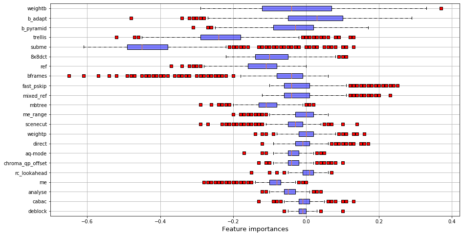
    


# RQ2

## RQ2.1 - Group of performances


```python
def plot_corr_matrix(corr, method = 'ward', title=''):

    df = pd.DataFrame(corr)
    
    links = linkage(df, method=method,)
    order = leaves_list(links)
    
    mask = np.zeros_like(corr, dtype=np.bool)
    
    for i in range(len(corr)):
        for j in range(len(corr)):
            if i>j:
                mask[order[i]][order[j]] = True
    
    g = sns.clustermap(df, cmap="vlag", mask=mask, method=method,
                   linewidths=0, figsize=(13, 13), vmin=-0.5)
    g.ax_heatmap.set_yticklabels([])
    g.ax_heatmap.set_xticklabels([])
    plt.title(title)
    plt.show()
    
    corrDescription = [corr[i][j] for i in range(len(corr)) for j in range(len(corr)) if i >j]
    return pd.Series(corrDescription).describe()

def plot_group(group_index):
    ind = np.array([k for k in range(len(corrSpearman)) if groups[k] == group_index], dtype=int)
    group = np.copy([[corrSpearman[k][j] for j in ind] for k in ind])
    print(plot_corr_matrix(group,title="group "+str(group_index)+" : "+str(len(group))))

for i in range(3):
    plot_group(i)
```


    
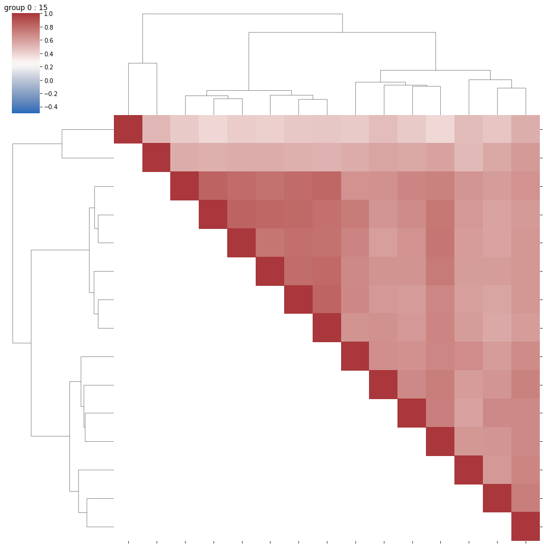
    


    count    105.000000
    mean       0.633228
    std        0.107270
    min        0.384018
    25%        0.576507
    50%        0.631524
    75%        0.697078
    max        0.835280
    dtype: float64


    
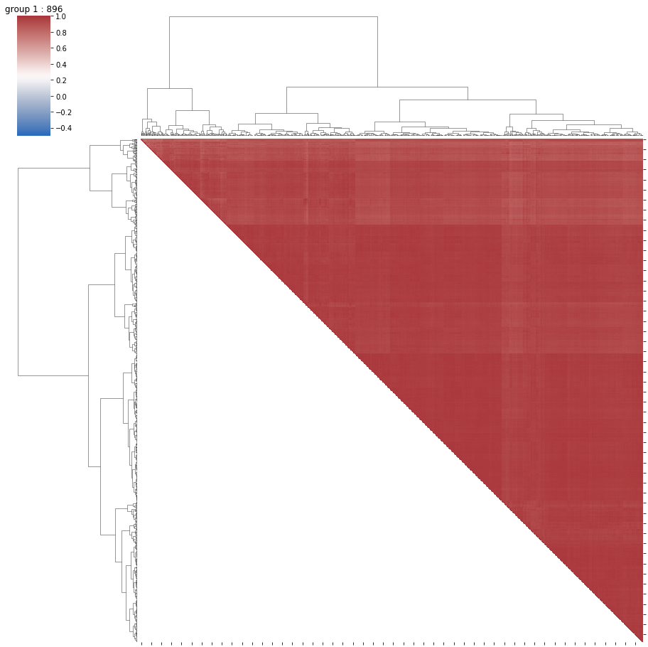
    


    count    400960.000000
    mean          0.952126
    std           0.029457
    min           0.746158
    25%           0.936815
    50%           0.960420
    75%           0.974537
    max           0.996437
    dtype: float64


    
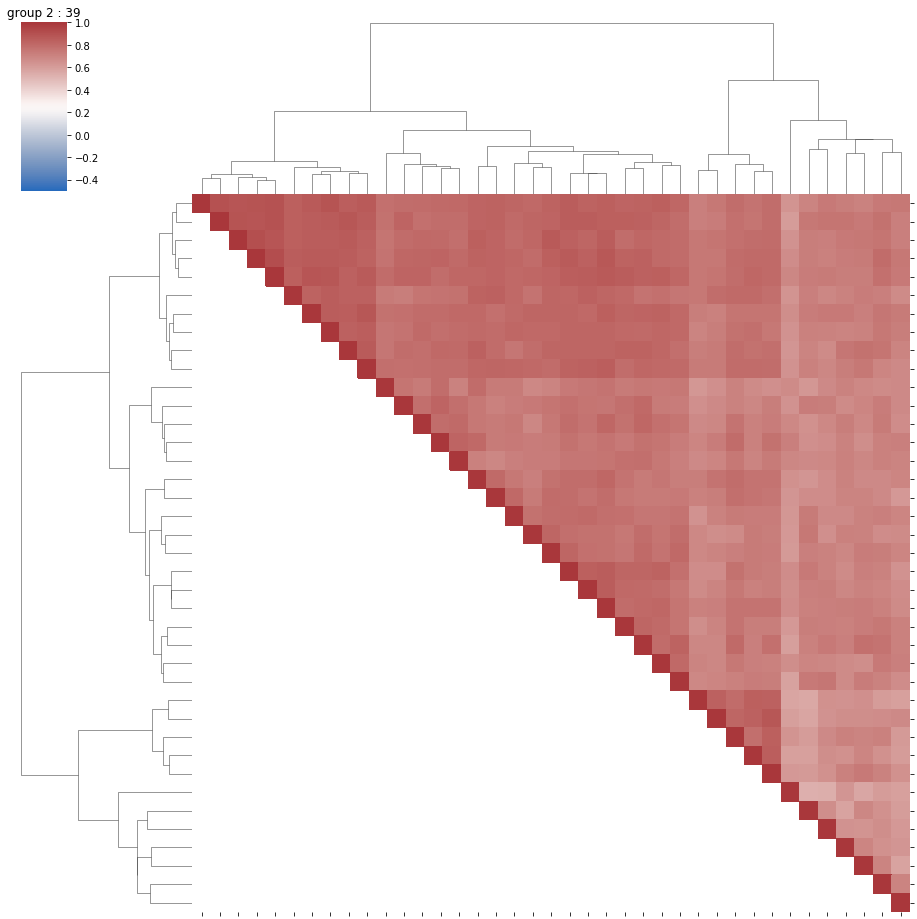
    


    count    741.000000
    mean       0.754152
    std        0.067906
    min        0.532387
    25%        0.709117
    50%        0.755396
    75%        0.806114
    max        0.913140
    dtype: float64


## Summary per group


```python
meta = pd.read_csv("../ugc_meta/all_features.csv").set_index('FILENAME')
meta['category']=[str(meta.index[i]).split('_')[0] for i in range(meta.shape[0])]
del meta['NOISE_DMOS']
meta = meta.fillna(0)
cat_tab = pd.Series(meta['category'].values).unique()
meta['video_category'] = [np.where(cat_tab==meta['category'][i])[0][0] for i in range(len(meta['category']))]
del meta['category']
for col in meta.columns:#[:len(meta.columns)-1]:
    inter = np.array(meta[col],float)
    meta[col] = (inter-np.mean(inter))/np.std(inter)
perf = pd.DataFrame({'FILENAME': np.array([v_names[k][:-4] for k in range(len(v_names))])[1:],
              'perf_group' : np.array([k for k in groups])[1:]}).set_index('FILENAME')
meta_perf = perf.join(meta)
meta_perf
```


<div>
<style scoped>
    .dataframe tbody tr th:only-of-type {
        vertical-align: middle;
    }

    .dataframe tbody tr th {
        vertical-align: top;
    }

    .dataframe thead th {
        text-align: right;
    }
</style>
<table border="1" class="dataframe">
  <thead>
    <tr style="text-align: right;">
      <th></th>
      <th>perf_group</th>
      <th>SLEEQ_DMOS</th>
      <th>BANDING_DMOS</th>
      <th>WIDTH</th>
      <th>HEIGHT</th>
      <th>SPATIAL_COMPLEXITY</th>
      <th>TEMPORAL_COMPLEXITY</th>
      <th>CHUNK_COMPLEXITY_VARIATION</th>
      <th>COLOR_COMPLEXITY</th>
      <th>video_category</th>
    </tr>
    <tr>
      <th>FILENAME</th>
      <th></th>
      <th></th>
      <th></th>
      <th></th>
      <th></th>
      <th></th>
      <th></th>
      <th></th>
      <th></th>
      <th></th>
    </tr>
  </thead>
  <tbody>
    <tr>
      <th>Animation_1080P-05f8</th>
      <td>1</td>
      <td>0.843640</td>
      <td>0.742227</td>
      <td>0.380890</td>
      <td>0.330315</td>
      <td>-0.147062</td>
      <td>0.443113</td>
      <td>2.546727</td>
      <td>2.208462</td>
      <td>-1.618994</td>
    </tr>
    <tr>
      <th>Animation_1080P-0c4f</th>
      <td>1</td>
      <td>-0.656518</td>
      <td>-0.377309</td>
      <td>0.380890</td>
      <td>0.330315</td>
      <td>0.422696</td>
      <td>-0.963894</td>
      <td>1.055535</td>
      <td>-1.232585</td>
      <td>-1.618994</td>
    </tr>
    <tr>
      <th>Animation_1080P-0cdf</th>
      <td>1</td>
      <td>-0.294941</td>
      <td>-0.059125</td>
      <td>0.380890</td>
      <td>0.330315</td>
      <td>-0.028411</td>
      <td>0.429840</td>
      <td>-0.102867</td>
      <td>-0.448165</td>
      <td>-1.618994</td>
    </tr>
    <tr>
      <th>Animation_1080P-18f5</th>
      <td>1</td>
      <td>-0.479576</td>
      <td>-0.377309</td>
      <td>0.380890</td>
      <td>0.330315</td>
      <td>1.289667</td>
      <td>-0.959469</td>
      <td>-0.050889</td>
      <td>0.193239</td>
      <td>-1.618994</td>
    </tr>
    <tr>
      <th>Animation_1080P-209f</th>
      <td>1</td>
      <td>6.282675</td>
      <td>-0.377309</td>
      <td>0.380890</td>
      <td>0.330315</td>
      <td>2.315231</td>
      <td>-1.512538</td>
      <td>-0.622865</td>
      <td>-1.232585</td>
      <td>-1.618994</td>
    </tr>
    <tr>
      <th>...</th>
      <td>...</td>
      <td>...</td>
      <td>...</td>
      <td>...</td>
      <td>...</td>
      <td>...</td>
      <td>...</td>
      <td>...</td>
      <td>...</td>
      <td>...</td>
    </tr>
    <tr>
      <th>Vlog_720P-561e</th>
      <td>1</td>
      <td>-0.679597</td>
      <td>-0.377309</td>
      <td>-0.241046</td>
      <td>-0.334452</td>
      <td>0.979531</td>
      <td>-1.415198</td>
      <td>-0.652628</td>
      <td>0.457602</td>
      <td>1.494285</td>
    </tr>
    <tr>
      <th>Vlog_720P-5d08</th>
      <td>1</td>
      <td>-0.679597</td>
      <td>-0.377309</td>
      <td>-0.773579</td>
      <td>-0.334452</td>
      <td>3.258561</td>
      <td>-0.304636</td>
      <td>-0.437382</td>
      <td>-0.157800</td>
      <td>1.494285</td>
    </tr>
    <tr>
      <th>Vlog_720P-60f8</th>
      <td>1</td>
      <td>0.443598</td>
      <td>0.624381</td>
      <td>-0.241046</td>
      <td>-0.334452</td>
      <td>0.234735</td>
      <td>-0.043587</td>
      <td>-0.364052</td>
      <td>-0.149132</td>
      <td>1.494285</td>
    </tr>
    <tr>
      <th>Vlog_720P-6410</th>
      <td>1</td>
      <td>-0.456497</td>
      <td>3.770868</td>
      <td>-0.241046</td>
      <td>-0.334452</td>
      <td>-0.770858</td>
      <td>2.120018</td>
      <td>1.971948</td>
      <td>-0.240142</td>
      <td>1.494285</td>
    </tr>
    <tr>
      <th>Vlog_720P-6d56</th>
      <td>1</td>
      <td>0.628233</td>
      <td>-0.353740</td>
      <td>-0.241046</td>
      <td>-0.334452</td>
      <td>-0.329149</td>
      <td>0.328075</td>
      <td>1.647785</td>
      <td>0.565947</td>
      <td>1.494285</td>
    </tr>
  </tbody>
</table>
<p>949 rows × 10 columns</p>
</div>


```python
meta_perf['str_video_cat'] = [str(meta_perf.index[i]).split('_')[0] for i in range(meta_perf.shape[0])]
total_cat = meta_perf.groupby('str_video_cat').count()['perf_group']
group_perf = np.array([gr for gr in groups])
group_perf
```


    array([1, 1, 1, 1, 1, 1, 1, 1, 1, 1, 1, 1, 1, 1, 1, 1, 1, 1, 1, 1, 1, 1,
           1, 1, 1, 1, 1, 1, 1, 1, 1, 1, 1, 1, 1, 1, 1, 1, 1, 1, 1, 1, 1, 1,
           1, 1, 1, 1, 1, 1, 1, 1, 1, 1, 1, 1, 1, 1, 1, 1, 1, 1, 1, 1, 1, 1,
           1, 1, 1, 1, 1, 1, 1, 1, 1, 1, 1, 1, 1, 1, 1, 1, 1, 1, 1, 1, 1, 1,
           1, 1, 1, 1, 1, 1, 1, 1, 1, 1, 1, 1, 1, 1, 1, 1, 1, 1, 1, 1, 1, 1,
           1, 1, 1, 1, 1, 1, 1, 1, 1, 1, 1, 1, 1, 1, 1, 1, 1, 1, 1, 1, 1, 1,
           1, 1, 1, 1, 1, 1, 1, 1, 1, 1, 1, 1, 1, 1, 1, 1, 1, 1, 1, 1, 1, 1,
           1, 1, 1, 1, 1, 1, 1, 1, 1, 1, 1, 1, 1, 1, 1, 1, 1, 1, 1, 1, 1, 1,
           1, 1, 1, 1, 1, 1, 1, 1, 1, 1, 1, 1, 1, 1, 1, 1, 1, 1, 1, 1, 1, 1,
           1, 1, 1, 1, 1, 1, 1, 1, 1, 1, 1, 1, 1, 1, 1, 1, 1, 1, 1, 1, 1, 1,
           1, 1, 1, 1, 1, 1, 1, 1, 1, 1, 1, 1, 1, 1, 1, 1, 1, 1, 2, 2, 2, 2,
           2, 2, 2, 2, 1, 2, 2, 2, 2, 2, 2, 2, 2, 1, 2, 2, 2, 2, 1, 2, 2, 2,
           0, 0, 2, 0, 2, 0, 2, 0, 0, 0, 0, 2, 0, 0, 2, 2, 0, 0, 2, 2, 2, 0,
           2, 2, 0, 0, 1, 1, 1, 1, 1, 1, 1, 1, 1, 1, 1, 1, 1, 1, 1, 1, 1, 2,
           1, 1, 1, 1, 1, 1, 1, 1, 1, 1, 1, 1, 1, 1, 1, 1, 1, 1, 1, 1, 1, 1,
           1, 1, 1, 1, 1, 1, 1, 1, 1, 1, 1, 1, 1, 1, 1, 1, 1, 1, 1, 1, 1, 1,
           1, 1, 1, 1, 1, 1, 1, 1, 1, 1, 1, 1, 1, 1, 1, 1, 1, 1, 1, 1, 1, 1,
           1, 1, 1, 1, 1, 1, 1, 1, 1, 1, 1, 1, 1, 1, 1, 1, 1, 1, 1, 1, 1, 1,
           1, 1, 1, 1, 1, 1, 1, 1, 1, 1, 1, 1, 1, 1, 1, 1, 1, 1, 1, 1, 1, 1,
           1, 1, 1, 1, 1, 1, 1, 1, 1, 1, 1, 1, 1, 1, 1, 1, 1, 1, 1, 1, 1, 1,
           1, 1, 1, 1, 1, 1, 1, 1, 1, 1, 1, 1, 1, 1, 1, 1, 1, 1, 1, 1, 1, 1,
           1, 1, 1, 1, 1, 1, 1, 1, 1, 1, 1, 1, 1, 1, 1, 1, 1, 1, 1, 1, 1, 1,
           1, 1, 1, 1, 1, 1, 1, 1, 1, 1, 1, 1, 1, 1, 1, 1, 1, 1, 1, 1, 1, 1,
           1, 1, 1, 1, 1, 1, 1, 1, 1, 1, 1, 1, 1, 1, 1, 1, 1, 1, 1, 1, 1, 1,
           1, 1, 1, 1, 1, 1, 1, 1, 1, 1, 1, 1, 1, 1, 1, 1, 1, 1, 1, 1, 1, 1,
           1, 1, 1, 1, 1, 1, 1, 1, 1, 1, 1, 1, 1, 1, 1, 1, 1, 1, 1, 1, 1, 1,
           1, 1, 1, 1, 1, 1, 1, 1, 1, 1, 1, 1, 1, 1, 1, 1, 1, 1, 1, 1, 1, 1,
           1, 1, 1, 1, 1, 1, 1, 1, 1, 1, 1, 1, 1, 1, 1, 1, 1, 1, 1, 1, 1, 1,
           1, 1, 1, 1, 1, 1, 1, 1, 1, 1, 1, 1, 1, 1, 1, 1, 1, 1, 1, 1, 1, 1,
           1, 1, 1, 1, 1, 1, 1, 1, 1, 1, 1, 1, 1, 1, 1, 1, 1, 1, 1, 2, 1, 1,
           1, 1, 1, 1, 1, 1, 1, 1, 1, 1, 1, 1, 1, 1, 1, 1, 1, 1, 1, 1, 1, 1,
           1, 1, 1, 1, 1, 1, 1, 2, 1, 1, 1, 1, 1, 1, 1, 1, 1, 1, 1, 1, 1, 1,
           1, 1, 1, 1, 1, 1, 1, 1, 1, 1, 1, 1, 1, 1, 1, 1, 2, 1, 1, 1, 1, 1,
           1, 1, 1, 1, 1, 1, 1, 1, 1, 1, 1, 1, 1, 1, 1, 1, 1, 1, 1, 1, 1, 1,
           1, 1, 1, 1, 1, 1, 1, 1, 1, 1, 1, 1, 1, 1, 1, 1, 1, 1, 1, 1, 1, 1,
           1, 2, 1, 1, 1, 1, 1, 1, 1, 1, 1, 1, 1, 1, 1, 1, 1, 1, 1, 1, 1, 1,
           1, 1, 1, 1, 1, 1, 1, 1, 1, 1, 1, 1, 1, 1, 1, 1, 1, 1, 1, 1, 1, 1,
           1, 1, 1, 1, 1, 1, 1, 1, 1, 1, 1, 1, 1, 1, 1, 1, 1, 1, 1, 1, 1, 1,
           1, 1, 1, 1, 1, 1, 1, 1, 1, 1, 1, 1, 1, 1, 1, 1, 1, 1, 1, 1, 1, 1,
           1, 1, 1, 1, 1, 1, 1, 1, 1, 1, 1, 1, 1, 1, 1, 1, 1, 1, 1, 1, 1, 1,
           1, 1, 1, 1, 1, 1, 1, 1, 1, 1, 1, 1, 1, 1, 1, 1, 1, 1, 1, 1, 1, 1,
           1, 1, 1, 1, 1, 1, 1, 1, 1, 1, 1, 1, 1, 1, 1, 1, 1, 1, 1, 1, 1, 1,
           1, 1, 1, 1, 1, 1, 1, 1, 1, 1, 1, 1, 1, 1, 1, 1, 1, 1, 1, 1, 1, 1,
           1, 1, 1, 1])


```python
def summary_group(id_group):
            
    id_list = [i for i in range(len(listVideo)) if group_perf[i]==id_group]
    v_names_group = [v_names[i][:-4] for i in range(len(v_names)) if i in id_list]
    listVideoGroup = [listVideo[i] for i in range(len(listVideo)) if i in id_list]
    
    print('Group '+str(id_group)+' : '+str(len(listVideoGroup))+' videos!')
    
    print('\n')

    # features importances
    boxplot_imp(compute_Importances(listVideoGroup), criteria = 'name', xlim= (0, 1),
               name ="../results/boxplot_imp_group"+str(id_group)+".png")

    # features effects
    boxplot_imp(compute_poly(listVideoGroup), criteria = 'name', xlim = (-1, 1),
               name ="../results/boxplot_effect_group"+str(id_group)+".png")

    print('\n')

    interest_var = ['cpu', 'etime', 'fps', 'kbs', 'size']

    for iv in interest_var:
        pred = [np.mean(lv[iv]) for lv in listVideoGroup]
        print('Mean '+iv+' in the group: '+str(np.round(np.mean(pred),1)))

    print('\n')

    # percentage of the videos present in the group par category

    meta_perf_group = meta_perf.query('perf_group=='+str(id_group))
    meta_perf_group['str_video_cat'] = [str(meta_perf_group.index[i]).split('_')[0] for i in range(meta_perf_group.shape[0])]
    val_group = meta_perf_group.groupby('str_video_cat').count()['perf_group']
    df_res_cat_group = pd.DataFrame({'val': val_group, 'total': total_cat})
    print(df_res_cat_group['val']/df_res_cat_group['total'])

    print('\n')

    # Mean of the videos of the group per properties

    for col in meta_perf_group.columns:
        if col not in ['str_video_cat', 'video_category']:
            print('Mean '+col+' : '+str(meta_perf_group[col].mean()))

    print('\n')

    corrGroup = np.array([corrSpearman[i][j] for i in range(len(corrSpearman)) if i in id_list 
                 for j in range(len(corrSpearman)) if j in id_list],float)

    print("Correlations intra-group: \n" + str(pd.Series(corrGroup).describe().iloc[[1,5]])+'\n')
```


```python
summary_group(0)
```

    Group 0 : 15 videos!
    
    


    
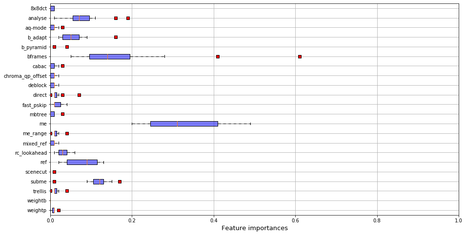
    


    

    


    
    
    Mean cpu in the group: 608.1
    Mean etime in the group: 133.0
    Mean fps in the group: 10.4
    Mean kbs in the group: 22969.9
    Mean size in the group: 57411331.1
    
    
    Animation              NaN
    CoverSong              NaN
    Gaming                 NaN
    HDR               0.288462
    HowTo                  NaN
    Lecture                NaN
    LiveMusic              NaN
    LyricVideo             NaN
    MusicVideo             NaN
    NewsClip               NaN
    Sports                 NaN
    TelevisionClip         NaN
    VR                     NaN
    VerticalVideo          NaN
    Vlog                   NaN
    dtype: float64
    
    
    Mean perf_group : 0.0
    Mean SLEEQ_DMOS : 0.8215865905365151
    Mean BANDING_DMOS : 0.13021386979319585
    Mean WIDTH : 2.2466975990572786
    Mean HEIGHT : 2.324616229477876
    Mean SPATIAL_COMPLEXITY : -0.688468213523051
    Mean TEMPORAL_COMPLEXITY : -0.0922572754485418
    Mean CHUNK_COMPLEXITY_VARIATION : -0.43620320172195787
    Mean COLOR_COMPLEXITY : -0.29705954798404405
    
    
    Correlations intra-group: 
    mean    0.657680
    50%     0.636756
    dtype: float64
    


    /home/llesoil/anaconda3/envs/x264/lib/python3.7/site-packages/ipykernel_launcher.py:32: SettingWithCopyWarning: 
    A value is trying to be set on a copy of a slice from a DataFrame.
    Try using .loc[row_indexer,col_indexer] = value instead
    
    See the caveats in the documentation: https://pandas.pydata.org/pandas-docs/stable/user_guide/indexing.html#returning-a-view-versus-a-copy


```python
summary_group(1)
```

    Group 1 : 896 videos!
    
    


    

    


    
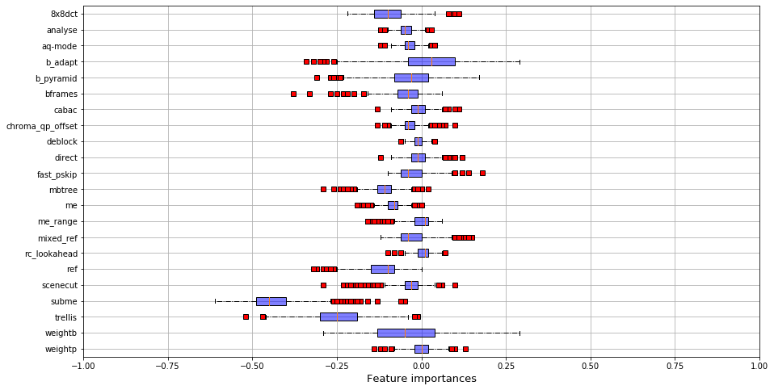
    


    
    
    Mean cpu in the group: 977.5
    Mean etime in the group: 7.9
    Mean fps in the group: 441.8
    Mean kbs in the group: 9420.3
    Mean size in the group: 23273342.0
    
    
    str_video_cat
    Animation         1.000000
    CoverSong         1.000000
    Gaming            1.000000
    HDR               0.057692
    HowTo             0.988506
    Lecture           1.000000
    LiveMusic         1.000000
    LyricVideo        1.000000
    MusicVideo        1.000000
    NewsClip          1.000000
    Sports            1.000000
    TelevisionClip    1.000000
    VR                0.971429
    VerticalVideo     0.973333
    Vlog              1.000000
    dtype: float64
    
    
    Mean perf_group : 1.0
    Mean SLEEQ_DMOS : -0.023980309271644372
    Mean BANDING_DMOS : 0.03552015326947296
    Mean WIDTH : -0.04681702178204547
    Mean HEIGHT : -0.037452575181915866
    Mean SPATIAL_COMPLEXITY : 0.01002524926522376
    Mean TEMPORAL_COMPLEXITY : -0.0008346747517759351
    Mean CHUNK_COMPLEXITY_VARIATION : 0.05347664024341069
    Mean COLOR_COMPLEXITY : -0.008866713390668211
    
    


    /home/llesoil/anaconda3/envs/x264/lib/python3.7/site-packages/ipykernel_launcher.py:32: SettingWithCopyWarning: 
    A value is trying to be set on a copy of a slice from a DataFrame.
    Try using .loc[row_indexer,col_indexer] = value instead
    
    See the caveats in the documentation: https://pandas.pydata.org/pandas-docs/stable/user_guide/indexing.html#returning-a-view-versus-a-copy


    Correlations intra-group: 
    mean    0.952179
    50%     0.960457
    dtype: float64
    


```python
summary_group(2)
```

    Group 2 : 39 videos!
    
    


    
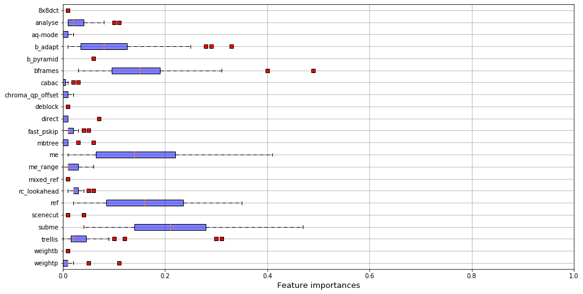
    


    

    


    
    
    Mean cpu in the group: 692.9
    Mean etime in the group: 45.9
    Mean fps in the group: 54.2
    Mean kbs in the group: 18528.3
    Mean size in the group: 46082119.8
    
    
    Animation              NaN
    CoverSong              NaN
    Gaming                 NaN
    HDR               0.653846
    HowTo             0.011494
    Lecture                NaN
    LiveMusic              NaN
    LyricVideo             NaN
    MusicVideo             NaN
    NewsClip               NaN
    Sports                 NaN
    TelevisionClip         NaN
    VR                0.028571
    VerticalVideo     0.026667
    Vlog                   NaN
    dtype: float64
    
    
    Mean perf_group : 2.0
    Mean SLEEQ_DMOS : -0.17303506880669778
    Mean BANDING_DMOS : -0.30509092522078857
    Mean WIDTH : 0.9856826727426452
    Mean HEIGHT : 0.9897791239973214
    Mean SPATIAL_COMPLEXITY : -0.6963963223003958
    Mean TEMPORAL_COMPLEXITY : 0.048647666696605266
    Mean CHUNK_COMPLEXITY_VARIATION : -0.43584484577258353
    Mean COLOR_COMPLEXITY : 0.736076732853525
    
    
    Correlations intra-group: 
    mean    0.760456
    50%     0.759155
    dtype: float64
    


    /home/llesoil/anaconda3/envs/x264/lib/python3.7/site-packages/ipykernel_launcher.py:32: SettingWithCopyWarning: 
    A value is trying to be set on a copy of a slice from a DataFrame.
    Try using .loc[row_indexer,col_indexer] = value instead
    
    See the caveats in the documentation: https://pandas.pydata.org/pandas-docs/stable/user_guide/indexing.html#returning-a-view-versus-a-copy


```python
group_perf
id_list_0 = [i for i in range(len(listVideo)) if group_perf[i]==0]
id_list_1 = [i for i in range(len(listVideo)) if group_perf[i]==1]
id_list_2 = [i for i in range(len(listVideo)) if group_perf[i]==2]

res = np.zeros(9).reshape(3,3)

tab = []
for id0 in id_list_0:
    for id1 in id_list_1:
        tab.append(corrSpearman[id0][id1])
res[0][1] = np.mean(tab)

for id0 in id_list_0:
    for id2 in id_list_2:
        tab.append(corrSpearman[id0][id2])
res[0][2] = np.mean(tab)

for id1 in id_list_1:
    for id2 in id_list_2:
        tab.append(corrSpearman[id1][id2])
res[1][2] = np.mean(tab)

print(res)

res_med = np.zeros(9).reshape(3,3)

tab = []
for id0 in id_list_0:
    for id1 in id_list_1:
        tab.append(corrSpearman[id0][id1])
res_med[0][1] = np.median(tab)

for id0 in id_list_0:
    for id2 in id_list_2:
        tab.append(corrSpearman[id0][id2])
res_med[0][2] = np.median(tab)

for id1 in id_list_1:
    for id2 in id_list_2:
        tab.append(corrSpearman[id1][id2])
res_med[1][2] = np.median(tab)

res_med
```

    [[0.         0.10236622 0.39042802]
     [0.         0.         0.4402605 ]
     [0.         0.         0.        ]]


    array([[0.        , 0.10941812, 0.42301883],
           [0.        , 0.        , 0.47749604],
           [0.        , 0.        , 0.        ]])


## Penalized regression


```python
def compute_lasso_reg(listVid, id_short=None, sort_method = 'mean'):
    
    if not id_short:
        id_short = np.arange(0,len(listVid),1)
    
    listImportances = []
    
    to_keep = [k for k in listFeatures]
    to_keep.append(predDimension)
    
    names = listFeatures
    final_names = []
    final_names.append('constant')
    #for n in names:
    #    final_names.append(n)
    for n1 in range(len(names)):
        for n2 in range(len(names)):
            if n1>=n2:
                final_names.append(str(names[n1])+'*'+str(names[n2]))
    
    for id_video in range(len(listVid)):

        df = listVid[id_video][to_keep].replace(to_replace ="None",value='0')
        df['deblock'] =[int(val[0]) for val in df['deblock']]
        for col in df.columns:
            if col not in categorial:
                if col != predDimension:
                    arr_col = np.array(df[col],int)
                    arr_col = (arr_col-np.mean(arr_col))/(np.std(arr_col)+1e-5)
                    df[col] = arr_col
            else:
                df[col] = [np.where(k==df[col].unique())[0][0] for k in df[col]]
                arr_col = np.array(df[col],int)
                arr_col = (arr_col-np.mean(arr_col))/(np.std(arr_col)+1e-5)
                df[col] = arr_col
        clf = ElasticNet(l1_ratio = 1, tol = 0.01)
        X = df.drop([predDimension],axis=1)
        y = df[predDimension]
        
        poly = PolynomialFeatures(degree=2, interaction_only = True, include_bias = True)
        
        X_interact = pd.DataFrame(poly.fit_transform(X), columns=final_names)
        
        clf.fit(X_interact,y)
        
        listImportances.append(clf.coef_)

    res = pd.DataFrame({'features' : final_names})
    
    cs = 100
    
    for id_video in range(len(listImportances)):
        res['video_'+str(id_short[id_video])] = listImportances[id_video]
    
    res = res.set_index('features').transpose()
    
    feats = []
    for f in res.columns:
        if sort_method == 'mean':
            feats.append(np.mean(np.abs(res[f])))
        elif sort_method == 'max_abs':
            feats.append(np.max(np.abs(res[f])))
    
    return res[pd.Series(feats, res.columns).sort_values(ascending=False)[0:25].index]
```


```python
boxplot_imp(compute_lasso_reg(listVideo[0:5], sort_method = 'mean'))
```


    

    


### With dummification - Fixed values for features


```python
vid = listVideo[0]

keep_features = ['cabac', 'ref', 'deblock', 'analyse', 'me', 'subme',
       'mixed_ref', 'me_range', 'trellis', '8x8dct', 'fast_pskip',
       'chroma_qp_offset', 'bframes', 'b_pyramid', 'b_adapt', 'direct',
       'weightb', 'open_gop', 'weightp', 'scenecut', 'rc_lookahead', 'mbtree',
       'qpmax', 'aq-mode']

dummies = pd.get_dummies(vid[keep_features], 
                   drop_first = False,
                   columns=keep_features)

X = pd.DataFrame(np.array(dummies, dtype=int))

poly = PolynomialFeatures(degree=2, interaction_only = True, include_bias = False)

dum_names = dummies.columns

X_interact = pd.DataFrame(np.array(poly.fit_transform(dummies),int))

names = []
for i in range(len(dum_names)):
    names.append(dum_names[i])
for i in range(len(dum_names)):
    for j in np.arange(i+1,len(dum_names), 1):
        names.append(dum_names[i] + " " + dum_names[j])

X_interact.columns = names
X_interact
```


<div>
<style scoped>
    .dataframe tbody tr th:only-of-type {
        vertical-align: middle;
    }

    .dataframe tbody tr th {
        vertical-align: top;
    }

    .dataframe thead th {
        text-align: right;
    }
</style>
<table border="1" class="dataframe">
  <thead>
    <tr style="text-align: right;">
      <th></th>
      <th>cabac_0</th>
      <th>cabac_1</th>
      <th>ref_1</th>
      <th>ref_2</th>
      <th>ref_3</th>
      <th>ref_5</th>
      <th>ref_7</th>
      <th>ref_8</th>
      <th>ref_16</th>
      <th>deblock_0:0:0</th>
      <th>...</th>
      <th>mbtree_0 mbtree_1</th>
      <th>mbtree_0 qpmax_69</th>
      <th>mbtree_0 aq-mode_0</th>
      <th>mbtree_0 aq-mode_1</th>
      <th>mbtree_1 qpmax_69</th>
      <th>mbtree_1 aq-mode_0</th>
      <th>mbtree_1 aq-mode_1</th>
      <th>qpmax_69 aq-mode_0</th>
      <th>qpmax_69 aq-mode_1</th>
      <th>aq-mode_0 aq-mode_1</th>
    </tr>
  </thead>
  <tbody>
    <tr>
      <th>0</th>
      <td>1</td>
      <td>0</td>
      <td>1</td>
      <td>0</td>
      <td>0</td>
      <td>0</td>
      <td>0</td>
      <td>0</td>
      <td>0</td>
      <td>1</td>
      <td>...</td>
      <td>0</td>
      <td>1</td>
      <td>1</td>
      <td>0</td>
      <td>0</td>
      <td>0</td>
      <td>0</td>
      <td>1</td>
      <td>0</td>
      <td>0</td>
    </tr>
    <tr>
      <th>1</th>
      <td>0</td>
      <td>1</td>
      <td>0</td>
      <td>1</td>
      <td>0</td>
      <td>0</td>
      <td>0</td>
      <td>0</td>
      <td>0</td>
      <td>0</td>
      <td>...</td>
      <td>0</td>
      <td>0</td>
      <td>0</td>
      <td>0</td>
      <td>1</td>
      <td>0</td>
      <td>1</td>
      <td>0</td>
      <td>1</td>
      <td>0</td>
    </tr>
    <tr>
      <th>2</th>
      <td>0</td>
      <td>1</td>
      <td>0</td>
      <td>1</td>
      <td>0</td>
      <td>0</td>
      <td>0</td>
      <td>0</td>
      <td>0</td>
      <td>0</td>
      <td>...</td>
      <td>0</td>
      <td>0</td>
      <td>0</td>
      <td>0</td>
      <td>1</td>
      <td>1</td>
      <td>0</td>
      <td>1</td>
      <td>0</td>
      <td>0</td>
    </tr>
    <tr>
      <th>3</th>
      <td>0</td>
      <td>1</td>
      <td>0</td>
      <td>1</td>
      <td>0</td>
      <td>0</td>
      <td>0</td>
      <td>0</td>
      <td>0</td>
      <td>1</td>
      <td>...</td>
      <td>0</td>
      <td>0</td>
      <td>0</td>
      <td>0</td>
      <td>1</td>
      <td>1</td>
      <td>0</td>
      <td>1</td>
      <td>0</td>
      <td>0</td>
    </tr>
    <tr>
      <th>4</th>
      <td>0</td>
      <td>1</td>
      <td>0</td>
      <td>0</td>
      <td>0</td>
      <td>0</td>
      <td>0</td>
      <td>0</td>
      <td>1</td>
      <td>0</td>
      <td>...</td>
      <td>0</td>
      <td>1</td>
      <td>0</td>
      <td>1</td>
      <td>0</td>
      <td>0</td>
      <td>0</td>
      <td>0</td>
      <td>1</td>
      <td>0</td>
    </tr>
    <tr>
      <th>...</th>
      <td>...</td>
      <td>...</td>
      <td>...</td>
      <td>...</td>
      <td>...</td>
      <td>...</td>
      <td>...</td>
      <td>...</td>
      <td>...</td>
      <td>...</td>
      <td>...</td>
      <td>...</td>
      <td>...</td>
      <td>...</td>
      <td>...</td>
      <td>...</td>
      <td>...</td>
      <td>...</td>
      <td>...</td>
      <td>...</td>
      <td>...</td>
    </tr>
    <tr>
      <th>196</th>
      <td>0</td>
      <td>1</td>
      <td>0</td>
      <td>1</td>
      <td>0</td>
      <td>0</td>
      <td>0</td>
      <td>0</td>
      <td>0</td>
      <td>0</td>
      <td>...</td>
      <td>0</td>
      <td>0</td>
      <td>0</td>
      <td>0</td>
      <td>1</td>
      <td>0</td>
      <td>1</td>
      <td>0</td>
      <td>1</td>
      <td>0</td>
    </tr>
    <tr>
      <th>197</th>
      <td>0</td>
      <td>1</td>
      <td>0</td>
      <td>1</td>
      <td>0</td>
      <td>0</td>
      <td>0</td>
      <td>0</td>
      <td>0</td>
      <td>1</td>
      <td>...</td>
      <td>0</td>
      <td>0</td>
      <td>0</td>
      <td>0</td>
      <td>1</td>
      <td>0</td>
      <td>1</td>
      <td>0</td>
      <td>1</td>
      <td>0</td>
    </tr>
    <tr>
      <th>198</th>
      <td>0</td>
      <td>1</td>
      <td>0</td>
      <td>0</td>
      <td>0</td>
      <td>1</td>
      <td>0</td>
      <td>0</td>
      <td>0</td>
      <td>0</td>
      <td>...</td>
      <td>0</td>
      <td>0</td>
      <td>0</td>
      <td>0</td>
      <td>1</td>
      <td>0</td>
      <td>1</td>
      <td>0</td>
      <td>1</td>
      <td>0</td>
    </tr>
    <tr>
      <th>199</th>
      <td>1</td>
      <td>0</td>
      <td>0</td>
      <td>0</td>
      <td>1</td>
      <td>0</td>
      <td>0</td>
      <td>0</td>
      <td>0</td>
      <td>1</td>
      <td>...</td>
      <td>0</td>
      <td>1</td>
      <td>0</td>
      <td>1</td>
      <td>0</td>
      <td>0</td>
      <td>0</td>
      <td>0</td>
      <td>1</td>
      <td>0</td>
    </tr>
    <tr>
      <th>200</th>
      <td>0</td>
      <td>1</td>
      <td>0</td>
      <td>0</td>
      <td>0</td>
      <td>0</td>
      <td>0</td>
      <td>0</td>
      <td>1</td>
      <td>0</td>
      <td>...</td>
      <td>0</td>
      <td>0</td>
      <td>0</td>
      <td>0</td>
      <td>1</td>
      <td>0</td>
      <td>1</td>
      <td>0</td>
      <td>1</td>
      <td>0</td>
    </tr>
  </tbody>
</table>
<p>201 rows × 3081 columns</p>
</div>


```python
def compute_lasso(id_group):
    id_video = [i for i in range(len(listVideo)) if group_perf[i]==id_group]
    keep_inter = []
    for idv in id_video:
        vid = listVideo[idv]
        regr = ElasticNet(l1_ratio = 1, tol = 0.01)
        regr.fit(X_interact, vid[predDimension])
        serie = pd.Series(np.abs(regr.coef_), names)
        keep_inter.append(np.array(serie.sort_values(ascending=False)[0:25].index, str))
    arr = np.array(keep_inter).reshape(-1,1)
    d = dict()
    for interact in arr:
        word = interact[0]
        if word not in d:
            d[word] = 1
        else:
            d[word] = d[word]+1
    res = pd.Series([d[w] for w in d.keys()], d.keys())
    return np.array(res.sort_values(ascending=False)[0:25].index, str)  
```


```python
for t in range(3):
    print(np.sort(compute_lasso(t)))
```

    ['analyse_0:0' 'analyse_0:0 subme_1' 'analyse_0x3:0x3 bframes_0'
     'aq-mode_0' 'cabac_0' 'cabac_0 analyse_0x3:0x133' 'cabac_0 bframes_16'
     'cabac_0 ref_1' 'cabac_0 ref_16' 'cabac_0 ref_3' 'cabac_0 ref_5'
     'cabac_0 ref_8' 'cabac_0 subme_11' 'cabac_1 deblock_0:0:0'
     'cabac_1 scenecut_None' 'deblock_0:0:0' 'rc_lookahead_20' 'ref_1'
     'ref_16 subme_7' 'ref_2 subme_7' 'ref_3 analyse_0:0' 'scenecut_None'
     'subme_0' 'subme_2' 'subme_7']
    ['analyse_0:0 subme_1' 'aq-mode_0' 'bframes_0' 'cabac_0'
     'cabac_0 bframes_16' 'cabac_0 ref_1' 'cabac_0 ref_16' 'cabac_0 ref_3'
     'cabac_0 ref_5' 'cabac_0 subme_11' 'cabac_1 ref_7'
     'cabac_1 scenecut_None' 'mbtree_0' 'me_dia' 'me_hex subme_0' 'ref_1'
     'ref_2 subme_10' 'ref_3' 'ref_3 analyse_0x113:0x113' 'ref_7'
     'scenecut_None' 'subme_0' 'subme_1 rc_lookahead_10' 'subme_2' 'subme_6']
    ['analyse_0:0' 'analyse_0x3:0x3 bframes_0' 'b_pyramid_1' 'bframes_0'
     'cabac_0' 'cabac_0 bframes_16' 'cabac_0 ref_1' 'cabac_0 ref_16'
     'cabac_0 ref_3' 'cabac_0 ref_5' 'cabac_0 ref_8' 'cabac_0 subme_11'
     'cabac_1 deblock_0:0:0' 'cabac_1 ref_7' 'deblock_0:0:0' 'me_dia'
     'me_hex subme_0' 'me_tesa' 'ref_1' 'ref_2 subme_7' 'ref_7'
     'scenecut_None' 'subme_0' 'subme_2' 'subme_7']


## Quantile regression


```python
def compute_quantile_reg(listVid, id_short=None, quantile = 0.5):
    
    if not id_short:
        id_short = np.arange(0,len(listVid),1)
    
    listImportances = []
    
    to_keep = [k for k in listFeatures]
    to_keep.append(predDimension)
    
    for id_video in range(len(listVid)):

        df = listVid[id_video][to_keep].replace(to_replace ="None",value='0')
        df['deblock'] =[int(val[0]) for val in df['deblock']]
        for col in df.columns:
            if col not in categorial:
                if col != predDimension:
                    arr_col = np.array(df[col],int)
                    arr_col = (arr_col-np.mean(arr_col))/(np.std(arr_col)+1e-5)
                    df[col] = arr_col
            else:
                df[col] = [np.where(k==df[col].unique())[0][0] for k in df[col]]
                arr_col = np.array(df[col],int)
                arr_col = (arr_col-np.mean(arr_col))/(np.std(arr_col)+1e-5)
                df[col] = arr_col
        if quantile:
            clf = QuantileLinearRegression(quantile=quantile)
        else:
            clf = QuantileLinearRegression()
        X = df.drop([predDimension],axis=1)
        y = df[predDimension]
        
        clf.fit(X,y)
        
        listImportances.append(clf.coef_)

    res = pd.DataFrame({'features' : listFeatures})
    
    cs = 100
    
    for id_video in range(len(listImportances)):
        res['video_'+str(id_short[id_video])] = listImportances[id_video]
    
    return res.set_index('features').transpose()
```


```python
id_list = [i for i in range(len(listVideo)) if group_perf[i]==0]
listVideoGroup = [listVideo[i] for i in range(len(listVideo)) if i in id_list]
quantile = [0.1*k for k in np.arange(0.1,1,0.1)]
for q in quantile:
    boxplot_imp(compute_quantile_reg(listVideoGroup, quantile = q))
```


    

    


    
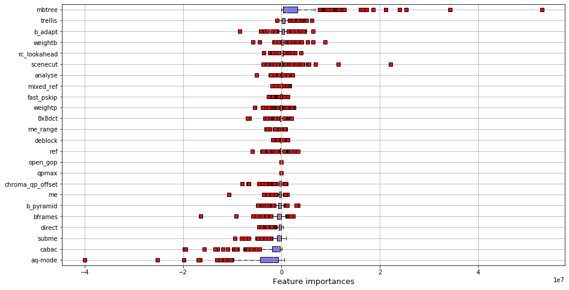
    


    
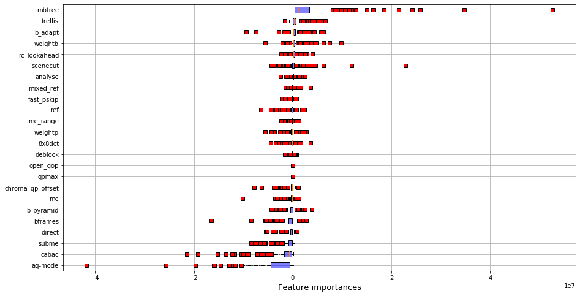
    


    

    


    

    


    

    


    
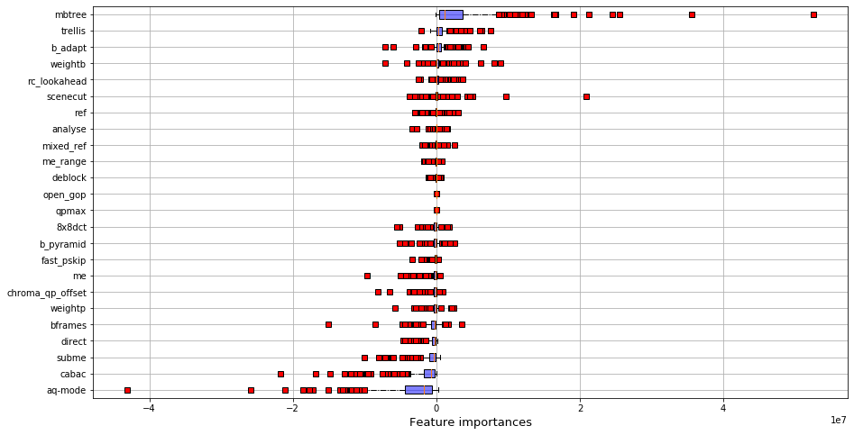
    


    
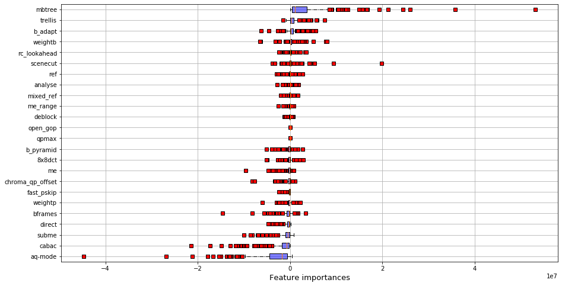
    


    
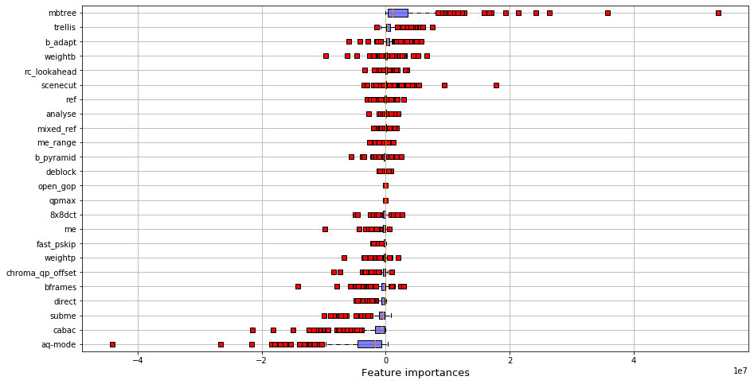
    


## RQ2.2 - Group classification


```python
if 'str_video_cat' in meta_perf.columns:
    del meta_perf['str_video_cat']

accuracy = []

nbLaunches =10
for i in range(nbLaunches):
    X = np.array(meta_perf[[k for k in meta_perf.columns if k !='perf_group']], float)
    y = np.array(meta_perf['perf_group'], float)

    X_train, X_test, y_train, y_test = train_test_split(X, y, test_size=0.25)

    rf = RandomForestClassifier()
    rf.fit(X_train, y_train)
    y_pred = rf.predict(X_test)


    conf = pd.crosstab(y_pred, y_test)#, colnames=[1,2,3], rownames=[1,2,3])
    val = np.sum(np.diag(conf))/len(y_test)
    accuracy.append(val)
    print('Test accuracy : '+ str(val))
    conf.columns = pd.Int64Index([1,2,3], dtype='int64', name='Observed')
    conf.index = pd.Int64Index([1,2,3], dtype='int64', name='Predicted')
    conf
print(np.mean(accuracy))
conf
```

    Test accuracy : 0.772020725388601
    Test accuracy : 0.689119170984456
    Test accuracy : 0.7461139896373057
    Test accuracy : 0.7305699481865285
    Test accuracy : 0.7305699481865285
    Test accuracy : 0.6735751295336787
    Test accuracy : 0.7150259067357513
    Test accuracy : 0.7357512953367875
    Test accuracy : 0.7305699481865285
    Test accuracy : 0.7409326424870466
    0.7264248704663212


<div>
<style scoped>
    .dataframe tbody tr th:only-of-type {
        vertical-align: middle;
    }

    .dataframe tbody tr th {
        vertical-align: top;
    }

    .dataframe thead th {
        text-align: right;
    }
</style>
<table border="1" class="dataframe">
  <thead>
    <tr style="text-align: right;">
      <th>Observed</th>
      <th>1</th>
      <th>2</th>
      <th>3</th>
    </tr>
    <tr>
      <th>Predicted</th>
      <th></th>
      <th></th>
      <th></th>
    </tr>
  </thead>
  <tbody>
    <tr>
      <th>1</th>
      <td>39</td>
      <td>0</td>
      <td>11</td>
    </tr>
    <tr>
      <th>2</th>
      <td>0</td>
      <td>20</td>
      <td>11</td>
    </tr>
    <tr>
      <th>3</th>
      <td>11</td>
      <td>17</td>
      <td>84</td>
    </tr>
  </tbody>
</table>
</div>


```python
meta_perf
```


<div>
<style scoped>
    .dataframe tbody tr th:only-of-type {
        vertical-align: middle;
    }

    .dataframe tbody tr th {
        vertical-align: top;
    }

    .dataframe thead th {
        text-align: right;
    }
</style>
<table border="1" class="dataframe">
  <thead>
    <tr style="text-align: right;">
      <th></th>
      <th>perf_group</th>
      <th>SLEEQ_DMOS</th>
      <th>BANDING_DMOS</th>
      <th>WIDTH</th>
      <th>HEIGHT</th>
      <th>SPATIAL_COMPLEXITY</th>
      <th>TEMPORAL_COMPLEXITY</th>
      <th>CHUNK_COMPLEXITY_VARIATION</th>
      <th>COLOR_COMPLEXITY</th>
      <th>video_category</th>
    </tr>
    <tr>
      <th>FILENAME</th>
      <th></th>
      <th></th>
      <th></th>
      <th></th>
      <th></th>
      <th></th>
      <th></th>
      <th></th>
      <th></th>
      <th></th>
    </tr>
  </thead>
  <tbody>
    <tr>
      <th>Animation_1080P-05f8</th>
      <td>2</td>
      <td>0.843640</td>
      <td>0.742227</td>
      <td>0.380890</td>
      <td>0.330315</td>
      <td>-0.147062</td>
      <td>0.443113</td>
      <td>2.546727</td>
      <td>2.208462</td>
      <td>-1.618994</td>
    </tr>
    <tr>
      <th>Animation_1080P-0c4f</th>
      <td>2</td>
      <td>-0.656518</td>
      <td>-0.377309</td>
      <td>0.380890</td>
      <td>0.330315</td>
      <td>0.422696</td>
      <td>-0.963894</td>
      <td>1.055535</td>
      <td>-1.232585</td>
      <td>-1.618994</td>
    </tr>
    <tr>
      <th>Animation_1080P-0cdf</th>
      <td>0</td>
      <td>-0.294941</td>
      <td>-0.059125</td>
      <td>0.380890</td>
      <td>0.330315</td>
      <td>-0.028411</td>
      <td>0.429840</td>
      <td>-0.102867</td>
      <td>-0.448165</td>
      <td>-1.618994</td>
    </tr>
    <tr>
      <th>Animation_1080P-18f5</th>
      <td>0</td>
      <td>-0.479576</td>
      <td>-0.377309</td>
      <td>0.380890</td>
      <td>0.330315</td>
      <td>1.289667</td>
      <td>-0.959469</td>
      <td>-0.050889</td>
      <td>0.193239</td>
      <td>-1.618994</td>
    </tr>
    <tr>
      <th>Animation_1080P-209f</th>
      <td>2</td>
      <td>6.282675</td>
      <td>-0.377309</td>
      <td>0.380890</td>
      <td>0.330315</td>
      <td>2.315231</td>
      <td>-1.512538</td>
      <td>-0.622865</td>
      <td>-1.232585</td>
      <td>-1.618994</td>
    </tr>
    <tr>
      <th>...</th>
      <td>...</td>
      <td>...</td>
      <td>...</td>
      <td>...</td>
      <td>...</td>
      <td>...</td>
      <td>...</td>
      <td>...</td>
      <td>...</td>
      <td>...</td>
    </tr>
    <tr>
      <th>Vlog_720P-561e</th>
      <td>2</td>
      <td>-0.679597</td>
      <td>-0.377309</td>
      <td>-0.241046</td>
      <td>-0.334452</td>
      <td>0.979531</td>
      <td>-1.415198</td>
      <td>-0.652628</td>
      <td>0.457602</td>
      <td>1.494285</td>
    </tr>
    <tr>
      <th>Vlog_720P-5d08</th>
      <td>0</td>
      <td>-0.679597</td>
      <td>-0.377309</td>
      <td>-0.773579</td>
      <td>-0.334452</td>
      <td>3.258561</td>
      <td>-0.304636</td>
      <td>-0.437382</td>
      <td>-0.157800</td>
      <td>1.494285</td>
    </tr>
    <tr>
      <th>Vlog_720P-60f8</th>
      <td>0</td>
      <td>0.443598</td>
      <td>0.624381</td>
      <td>-0.241046</td>
      <td>-0.334452</td>
      <td>0.234735</td>
      <td>-0.043587</td>
      <td>-0.364052</td>
      <td>-0.149132</td>
      <td>1.494285</td>
    </tr>
    <tr>
      <th>Vlog_720P-6410</th>
      <td>1</td>
      <td>-0.456497</td>
      <td>3.770868</td>
      <td>-0.241046</td>
      <td>-0.334452</td>
      <td>-0.770858</td>
      <td>2.120018</td>
      <td>1.971948</td>
      <td>-0.240142</td>
      <td>1.494285</td>
    </tr>
    <tr>
      <th>Vlog_720P-6d56</th>
      <td>2</td>
      <td>0.628233</td>
      <td>-0.353740</td>
      <td>-0.241046</td>
      <td>-0.334452</td>
      <td>-0.329149</td>
      <td>0.328075</td>
      <td>1.647785</td>
      <td>0.565947</td>
      <td>1.494285</td>
    </tr>
  </tbody>
</table>
<p>769 rows × 10 columns</p>
</div>


```python
pd.DataFrame({'Random forest importance' : rf.feature_importances_,
              'name' : meta_perf.columns[1:]}).set_index('name')
```


<div>
<style scoped>
    .dataframe tbody tr th:only-of-type {
        vertical-align: middle;
    }

    .dataframe tbody tr th {
        vertical-align: top;
    }

    .dataframe thead th {
        text-align: right;
    }
</style>
<table border="1" class="dataframe">
  <thead>
    <tr style="text-align: right;">
      <th></th>
      <th>Random forest importance</th>
    </tr>
    <tr>
      <th>name</th>
      <th></th>
    </tr>
  </thead>
  <tbody>
    <tr>
      <th>SLEEQ_DMOS</th>
      <td>0.072091</td>
    </tr>
    <tr>
      <th>BANDING_DMOS</th>
      <td>0.046348</td>
    </tr>
    <tr>
      <th>WIDTH</th>
      <td>0.045705</td>
    </tr>
    <tr>
      <th>HEIGHT</th>
      <td>0.034997</td>
    </tr>
    <tr>
      <th>SPATIAL_COMPLEXITY</th>
      <td>0.289946</td>
    </tr>
    <tr>
      <th>TEMPORAL_COMPLEXITY</th>
      <td>0.209568</td>
    </tr>
    <tr>
      <th>CHUNK_COMPLEXITY_VARIATION</th>
      <td>0.148379</td>
    </tr>
    <tr>
      <th>COLOR_COMPLEXITY</th>
      <td>0.097515</td>
    </tr>
    <tr>
      <th>video_category</th>
      <td>0.055450</td>
    </tr>
  </tbody>
</table>
</div>


```python
meta_perf.groupby(['perf_group']).mean()
```


<div>
<style scoped>
    .dataframe tbody tr th:only-of-type {
        vertical-align: middle;
    }

    .dataframe tbody tr th {
        vertical-align: top;
    }

    .dataframe thead th {
        text-align: right;
    }
</style>
<table border="1" class="dataframe">
  <thead>
    <tr style="text-align: right;">
      <th></th>
      <th>SLEEQ_DMOS</th>
      <th>BANDING_DMOS</th>
      <th>WIDTH</th>
      <th>HEIGHT</th>
      <th>SPATIAL_COMPLEXITY</th>
      <th>TEMPORAL_COMPLEXITY</th>
      <th>CHUNK_COMPLEXITY_VARIATION</th>
      <th>COLOR_COMPLEXITY</th>
      <th>video_category</th>
    </tr>
    <tr>
      <th>perf_group</th>
      <th></th>
      <th></th>
      <th></th>
      <th></th>
      <th></th>
      <th></th>
      <th></th>
      <th></th>
      <th></th>
    </tr>
  </thead>
  <tbody>
    <tr>
      <th>0</th>
      <td>-0.078311</td>
      <td>-0.229780</td>
      <td>-0.116496</td>
      <td>-0.135671</td>
      <td>0.804723</td>
      <td>0.289698</td>
      <td>0.717640</td>
      <td>-0.082420</td>
      <td>0.043716</td>
    </tr>
    <tr>
      <th>1</th>
      <td>0.081870</td>
      <td>0.122683</td>
      <td>0.607173</td>
      <td>0.537666</td>
      <td>-0.891920</td>
      <td>0.661285</td>
      <td>-0.297182</td>
      <td>0.188592</td>
      <td>-0.008223</td>
    </tr>
    <tr>
      <th>2</th>
      <td>-0.071027</td>
      <td>0.103646</td>
      <td>-0.271269</td>
      <td>-0.301448</td>
      <td>-0.223278</td>
      <td>-0.461625</td>
      <td>-0.203138</td>
      <td>0.048928</td>
      <td>-0.386508</td>
    </tr>
  </tbody>
</table>
</div>


```python

```

## RQ2.3 - Auto-tune


```python
import tensorflow as tf
import tensorflow.keras as kr
print(tf.__version__)
```


```python
import tensorflow.compat.v1 as tf
tf.disable_v2_behavior() 
import numpy as np
import seaborn as sb
import matplotlib.pyplot as plt
sb.set()

def get_y(x):
    return 10 + x*x

def sample_data(n=10000, scale=100):
    data = []

    x = scale*(np.random.random_sample((n,))-0.5)

    for i in range(n):
        yi = get_y(x[i])
        data.append([x[i], yi])

    return np.array(data)

def sample_Z(m, n):
    return np.random.uniform(-1., 1., size=[m, n])

def generator(Z,hsize=[16, 16],reuse=False):
    with tf.variable_scope("GAN/Generator",reuse=reuse):
        h1 = tf.layers.dense(Z,hsize[0],activation=tf.nn.leaky_relu)
        h2 = tf.layers.dense(h1,hsize[1],activation=tf.nn.leaky_relu)
        out = tf.layers.dense(h2,2)

    return out

def discriminator(X,hsize=[16, 16],reuse=False):
    with tf.variable_scope("GAN/Discriminator",reuse=reuse):
        h1 = tf.layers.dense(X,hsize[0],activation=tf.nn.leaky_relu)
        h2 = tf.layers.dense(h1,hsize[1],activation=tf.nn.leaky_relu)
        h3 = tf.layers.dense(h2,2)
        out = tf.layers.dense(h3,1)

    return out, h3


X = tf.placeholder(tf.float32,[None,2])
Z = tf.placeholder(tf.float32,[None,2])

G_sample = generator(Z)
r_logits, r_rep = discriminator(X)
f_logits, g_rep = discriminator(G_sample,reuse=True)

disc_loss = tf.reduce_mean(tf.nn.sigmoid_cross_entropy_with_logits(logits=r_logits,labels=tf.ones_like(r_logits)) + tf.nn.sigmoid_cross_entropy_with_logits(logits=f_logits,labels=tf.zeros_like(f_logits)))
gen_loss = tf.reduce_mean(tf.nn.sigmoid_cross_entropy_with_logits(logits=f_logits,labels=tf.ones_like(f_logits)))

gen_vars = tf.get_collection(tf.GraphKeys.GLOBAL_VARIABLES,scope="GAN/Generator")
disc_vars = tf.get_collection(tf.GraphKeys.GLOBAL_VARIABLES,scope="GAN/Discriminator")

gen_step = tf.train.RMSPropOptimizer(learning_rate=0.001).minimize(gen_loss,var_list = gen_vars) # G Train step
disc_step = tf.train.RMSPropOptimizer(learning_rate=0.001).minimize(disc_loss,var_list = disc_vars) # D Train step


# sess = tf.Session(config=config)
sess = tf.Session()
tf.global_variables_initializer().run(session=sess)

batch_size = 256
nd_steps = 10
ng_steps = 10

x_plot = sample_data(n=batch_size)

f = open('loss_logs.csv','w')
f.write('Iteration,Discriminator Loss,Generator Loss\n')

for i in range(10001):
    X_batch = sample_data(n=batch_size)
    Z_batch = sample_Z(batch_size, 2)

    for _ in range(nd_steps):
        _, dloss = sess.run([disc_step, disc_loss], feed_dict={X: X_batch, Z: Z_batch})
    rrep_dstep, grep_dstep = sess.run([r_rep, g_rep], feed_dict={X: X_batch, Z: Z_batch})

    for _ in range(ng_steps):
        _, gloss = sess.run([gen_step, gen_loss], feed_dict={Z: Z_batch})

    rrep_gstep, grep_gstep = sess.run([r_rep, g_rep], feed_dict={X: X_batch, Z: Z_batch})
    
    if i%1000 == 0:
        print("Iterations: %d\t Discriminator loss: %.4f\t Generator loss: %.4f"%(i,dloss,gloss))
        f.write("%d,%f,%f\n"%(i,dloss,gloss))

    if i%1000 == 0:
        plt.figure()
        g_plot = sess.run(G_sample, feed_dict={Z: Z_batch})
        xax = plt.scatter(x_plot[:,0], x_plot[:,1])
        gax = plt.scatter(g_plot[:,0],g_plot[:,1])

        plt.legend((xax,gax), ("Real Data","Generated Data"))
        plt.title('Samples at Iteration %d'%i)
        plt.tight_layout()
        plt.savefig('../iteration/iteration_%d.png'%i)
        plt.close()

        plt.figure()
        rrd = plt.scatter(rrep_dstep[:,0], rrep_dstep[:,1], alpha=0.5)
        rrg = plt.scatter(rrep_gstep[:,0], rrep_gstep[:,1], alpha=0.5)
        grd = plt.scatter(grep_dstep[:,0], grep_dstep[:,1], alpha=0.5)
        grg = plt.scatter(grep_gstep[:,0], grep_gstep[:,1], alpha=0.5)


        plt.legend((rrd, rrg, grd, grg), ("Real Data Before G step","Real Data After G step",
                               "Generated Data Before G step","Generated Data After G step"))
        plt.title('Transformed Features at Iteration %d'%i)
        plt.tight_layout()
        plt.savefig('../iteration/feature_transform_%d.png'%i)
        plt.close()

        plt.figure()

        rrdc = plt.scatter(np.mean(rrep_dstep[:,0]), np.mean(rrep_dstep[:,1]),s=100, alpha=0.5)
        rrgc = plt.scatter(np.mean(rrep_gstep[:,0]), np.mean(rrep_gstep[:,1]),s=100, alpha=0.5)
        grdc = plt.scatter(np.mean(grep_dstep[:,0]), np.mean(grep_dstep[:,1]),s=100, alpha=0.5)
        grgc = plt.scatter(np.mean(grep_gstep[:,0]), np.mean(grep_gstep[:,1]),s=100, alpha=0.5)

        plt.legend((rrdc, rrgc, grdc, grgc), ("Real Data Before G step","Real Data After G step",
                               "Generated Data Before G step","Generated Data After G step"))

        plt.title('Centroid of Transformed Features at Iteration %d'%i)
        plt.tight_layout()
        plt.savefig('../iteration/feature_transform_centroid_%d.png'%i)
        plt.close()

f.close()
```


```python

```


```python

```


```python

```


```python

```


```python

```


```python

```


```python
import numpy as np
import time
import tensorflow.compat.v1 as tf
tf.disable_v2_behavior() 

from tensorflow.examples.tutorials.mnist import input_data

from keras.models import Sequential
from keras.layers import Dense, Activation, Flatten, Reshape
from keras.layers import Conv2D, Conv2DTranspose, UpSampling2D
from keras.layers import LeakyReLU, Dropout
from keras.layers import BatchNormalization
from keras.optimizers import Adam, RMSprop

import matplotlib.pyplot as plt

class ElapsedTimer(object):
    def __init__(self):
        self.start_time = time.time()
    def elapsed(self,sec):
        if sec < 60:
            return str(sec) + " sec"
        elif sec < (60 * 60):
            return str(sec / 60) + " min"
        else:
            return str(sec / (60 * 60)) + " hr"
    def elapsed_time(self):
        print("Elapsed: %s " % self.elapsed(time.time() - self.start_time) )

class DCGAN(object):
    def __init__(self, img_rows=28, img_cols=28, channel=1):

        self.img_rows = img_rows
        self.img_cols = img_cols
        self.channel = channel
        self.D = None   # discriminator
        self.G = None   # generator
        self.AM = None  # adversarial model
        self.DM = None  # discriminator model

    # (W−F+2P)/S+1
    def discriminator(self):
        if self.D:
            return self.D
        self.D = Sequential()
        depth = 64
        dropout = 0.4
        # In: 28 x 28 x 1, depth = 1
        # Out: 14 x 14 x 1, depth=64
        input_shape = (self.img_rows, self.img_cols, self.channel)
        self.D.add(Conv2D(depth*1, 5, strides=2, input_shape=input_shape,\
            padding='same'))
        self.D.add(LeakyReLU(alpha=0.2))
        self.D.add(Dropout(dropout))

        self.D.add(Conv2D(depth*2, 5, strides=2, padding='same'))
        self.D.add(LeakyReLU(alpha=0.2))
        self.D.add(Dropout(dropout))

        self.D.add(Conv2D(depth*4, 5, strides=2, padding='same'))
        self.D.add(LeakyReLU(alpha=0.2))
        self.D.add(Dropout(dropout))

        self.D.add(Conv2D(depth*8, 5, strides=1, padding='same'))
        self.D.add(LeakyReLU(alpha=0.2))
        self.D.add(Dropout(dropout))

        # Out: 1-dim probability
        self.D.add(Flatten())
        self.D.add(Dense(1))
        self.D.add(Activation('sigmoid'))
        self.D.summary()
        return self.D

    def generator(self):
        if self.G:
            return self.G
        self.G = Sequential()
        dropout = 0.4
        depth = 64+64+64+64
        dim = 7
        # In: 100
        # Out: dim x dim x depth
        self.G.add(Dense(dim*dim*depth, input_dim=100))
        self.G.add(BatchNormalization(momentum=0.9))
        self.G.add(Activation('relu'))
        self.G.add(Reshape((dim, dim, depth)))
        self.G.add(Dropout(dropout))

        # In: dim x dim x depth
        # Out: 2*dim x 2*dim x depth/2
        self.G.add(UpSampling2D())
        self.G.add(Conv2DTranspose(int(depth/2), 5, padding='same'))
        self.G.add(BatchNormalization(momentum=0.9))
        self.G.add(Activation('relu'))

        self.G.add(UpSampling2D())
        self.G.add(Conv2DTranspose(int(depth/4), 5, padding='same'))
        self.G.add(BatchNormalization(momentum=0.9))
        self.G.add(Activation('relu'))

        self.G.add(Conv2DTranspose(int(depth/8), 5, padding='same'))
        self.G.add(BatchNormalization(momentum=0.9))
        self.G.add(Activation('relu'))

        # Out: 28 x 28 x 1 grayscale image [0.0,1.0] per pix
        self.G.add(Conv2DTranspose(1, 5, padding='same'))
        self.G.add(Activation('sigmoid'))
        self.G.summary()
        return self.G

    def discriminator_model(self):
        if self.DM:
            return self.DM
        optimizer = RMSprop(lr=0.0002, decay=6e-8)
        self.DM = Sequential()
        self.DM.add(self.discriminator())
        self.DM.compile(loss='binary_crossentropy', optimizer=optimizer,\
            metrics=['accuracy'])
        return self.DM

    def adversarial_model(self):
        if self.AM:
            return self.AM
        optimizer = RMSprop(lr=0.0001, decay=3e-8)
        self.AM = Sequential()
        self.AM.add(self.generator())
        self.AM.add(self.discriminator())
        self.AM.compile(loss='binary_crossentropy', optimizer=optimizer,\
            metrics=['accuracy'])
        return self.AM

class MNIST_DCGAN(object):
    def __init__(self):
        self.img_rows = 28
        self.img_cols = 28
        self.channel = 1

        self.x_train = input_data.read_data_sets("mnist",\
        	one_hot=True).train.images
        self.x_train = self.x_train.reshape(-1, self.img_rows,\
        	self.img_cols, 1).astype(np.float32)

        self.DCGAN = DCGAN()
        self.discriminator =  self.DCGAN.discriminator_model()
        self.adversarial = self.DCGAN.adversarial_model()
        self.generator = self.DCGAN.generator()

    def train(self, train_steps=2000, batch_size=256, save_interval=0):
        noise_input = None
        if save_interval>0:
            noise_input = np.random.uniform(-1.0, 1.0, size=[16, 100])
        for i in range(train_steps):
            images_train = self.x_train[np.random.randint(0,
                self.x_train.shape[0], size=batch_size), :, :, :]
            noise = np.random.uniform(-1.0, 1.0, size=[batch_size, 100])
            images_fake = self.generator.predict(noise)
            x = np.concatenate((images_train, images_fake))
            y = np.ones([2*batch_size, 1])
            y[batch_size:, :] = 0
            d_loss = self.discriminator.train_on_batch(x, y)

            y = np.ones([batch_size, 1])
            noise = np.random.uniform(-1.0, 1.0, size=[batch_size, 100])
            a_loss = self.adversarial.train_on_batch(noise, y)
            log_mesg = "%d: [D loss: %f, acc: %f]" % (i, d_loss[0], d_loss[1])
            log_mesg = "%s  [A loss: %f, acc: %f]" % (log_mesg, a_loss[0], a_loss[1])
            print(log_mesg)
            if save_interval>0:
                if (i+1)%save_interval==0:
                    self.plot_images(save2file=True, samples=noise_input.shape[0],\
                        noise=noise_input, step=(i+1))

    def plot_images(self, save2file=False, fake=True, samples=16, noise=None, step=0):
        filename = 'mnist.png'
        if fake:
            if noise is None:
                noise = np.random.uniform(-1.0, 1.0, size=[samples, 100])
            else:
                filename = "mnist_%d.png" % step
            images = self.generator.predict(noise)
        else:
            i = np.random.randint(0, self.x_train.shape[0], samples)
            images = self.x_train[i, :, :, :]

        plt.figure(figsize=(10,10))
        for i in range(images.shape[0]):
            plt.subplot(4, 4, i+1)
            image = images[i, :, :, :]
            image = np.reshape(image, [self.img_rows, self.img_cols])
            plt.imshow(image, cmap='gray')
            plt.axis('off')
        plt.tight_layout()
        if save2file:
            plt.savefig(filename)
            plt.close('all')
        else:
            plt.show()

mnist_dcgan = MNIST_DCGAN()
timer = ElapsedTimer()
mnist_dcgan.train(train_steps=10000, batch_size=256, save_interval=500)
timer.elapsed_time()
mnist_dcgan.plot_images(fake=True)
mnist_dcgan.plot_images(fake=False, save2file=True)
```

# PCA 


```python

```


```python

df_std_meta = meta[['SPATIAL_COMPLEXITY', 'TEMPORAL_COMPLEXITY', 
                          'CHUNK_COMPLEXITY_VARIATION','COLOR_COMPLEXITY']]
std_meta = np.array(df_std_meta)

kmeans = KMeans(n_clusters=3)
kmeans.fit(std_meta)
meta['clusters'] = kmeans.labels_
meta['category']=[str(meta.index[i]).split('_')[0] for i in range(meta.shape[0])]
meta['quality']=[str(meta.index[i]).split('_')[1].split('-')[0] for i in range(meta.shape[0])]


pca = PCA(n_components=2, svd_solver='full')
tab = pca.fit_transform(std_meta)
x = [tab[i][0] for i in range(len(tab))]
y = [tab[i][1] for i in range(len(tab))]

col = ['gray','red','green','black']

plt.figure(figsize=(16,8))
plt.title("Axis (PCA) Color Kmeans classes")
plt.scatter(x, y, color = [col[k] for k in meta['clusters']])
lab=np.array(meta.index,str)
#for i in range(len(x)):
#    plt.text(x[i], y[i], lab[i])
plt.show()
```


```python
pd.crosstab(meta_perf['perf_group'], meta['clusters'])
```


```python
meta_perf
```


```python

```


```python

```
